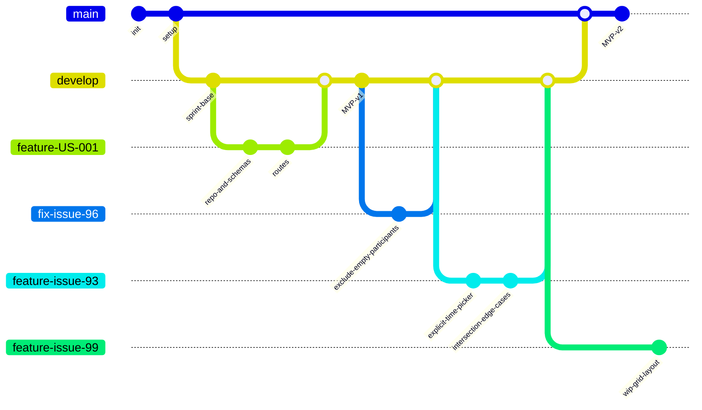

# Development Process

This is the maintained artifact for the When2Meet team development process and
configuration-management documentation. It describes the git workflow, branch
model, issue-linked PR requirements, review rules, configuration and secrets
handling, and CI gates that every contributor must follow.

The workflow is enforced through branch protection on `main`, required status
checks, and required pull-request reviews. The diagram below summarises the
branch flow; the sections after it explain how the team actually uses it.

## Git workflow

## What the diagram shows

- `main` is the protected default branch and the only branch that maps to a
  SemVer release tag (`v0.1.0` -> MVP v1, `v0.2.0` -> MVP v2). Releases are
  always a fast-forward merge of `develop` into `main` plus a `vX.Y.Z` tag.
- `develop` is the integration branch for the current Sprint. All completed
  Sprint PBIs accumulate here through reviewed pull requests.
- Every PBI (feature, bug fix, architecture, docs, infra) gets its own
  `feature/<issue>-<slug>` or `fix/<issue>-<slug>` branch, named after the
  linked GitHub issue.
- A branch is merged into `develop` only through a pull request that:
  - links the issue in the description (`Closes #N`),
  - is reviewed by a different team member than the implementer, and
  - passes the required CI status checks (`tests.yaml`, `when2meet-qa.yaml`,
    `lychee.yaml`).
- A Sprint ends with a `develop -> main` merge that produces the SemVer release
  mapped to the MVP increment, plus the Sprint milestone closure.

## How the team uses the workflow

1. **Planning.** During Sprint Planning the team assigns PBIs to the Sprint
   milestone on GitHub. Each PBI has an expected outcome, acceptance criteria,
   Story Points, an implementer, and a different reviewer.
2. **Branch.** The implementer creates `feature/<issue>-<slug>` from the latest
   `develop`. Branches are short-lived and single-purpose.
3. **Develop.** Commits are small and reference the issue (`#NN`).
4. **PR.** The implementer opens a PR into `develop` with `Closes #NN`, the
   acceptance criteria checklist, and screenshots or test evidence.
5. **Review.** A different reviewer reviews the diff, runs the relevant tests
   locally, and approves or requests changes. Implementer cannot self-merge.
6. **CI.** Required checks must pass on `develop` before merge: pytest with
   coverage on critical modules, quality-requirement tests, secret scan
   (gitleaks), and link checking (lychee).
7. **Merge.** Squash merge into `develop`. The linked issue moves to Done on
   the Sprint board.
8. **Release.** At Sprint end, `develop` is fast-forwarded to `main`, a
   `vX.Y.Z` tag is created pointing at the merge commit on `main`, and the
   GitHub Release links the Sprint milestone, the Week report, run
   instructions, and the public demo video.
9. **Deploy.** The release tag triggers the deploy pipeline that builds
   `api.Dockerfile` and ships the SPA; the hosted API at
   `api.innohassle.ru/when2meet/v0` and frontend at
   `pre.innohassle.ru/when2meet` are updated.

## Configuration management

- Application configuration lives in `settings.yaml` at the repository root and
  is loaded through `src.config_root_schema` into typed `ServiceSettingsBase`
  pydantic models (`When2MeetSettings`).
- `settings.yaml` contains environment-specific connection strings and is
  **not** committed; `settings.example.yaml` and `settings.schema.yaml` are the
  committed, sanitized template and JSON schema.
- Secrets are never committed. The `when2meet-qa.yaml` CI job runs gitleaks on
  When2Meet paths to prevent leaked tokens, JWTs, and credentials.
- Runtime secrets (Mongo credentials, Accounts service-account keys) are
  injected through environment variables or mounted files at deploy time; the
  `docker-compose.yaml` mounts `settings.yaml` read-only.
- The hosted documentation, this development-process document, the
  architecture documentation, ADRs, and quality artifacts are versioned in the
  same repository so that documentation, code, and configuration move together
  in every PR.
- Sprint 5 final-delivery evidence is preserved in
  [reports/week7/README.md](https://github.com/one-zero-eight/monorepo/blob/main/src/when2meet/reports/week7/README.md), including protected
  `main` links for tests, When2Meet secret scan, and link-check CI runs.

## Where this document is linked from

- Root `README.md`
- Hosted documentation site
- `reports/week7/README.md`
- `reports/week6/README.md`
- `reports/week5/README.md`
