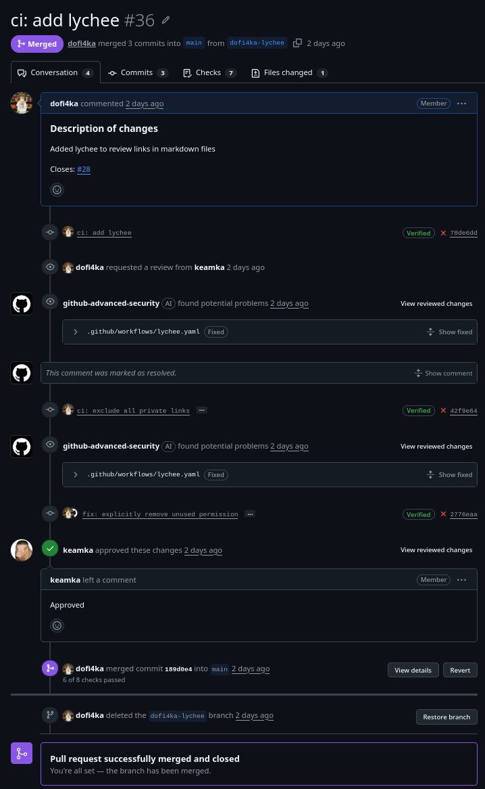
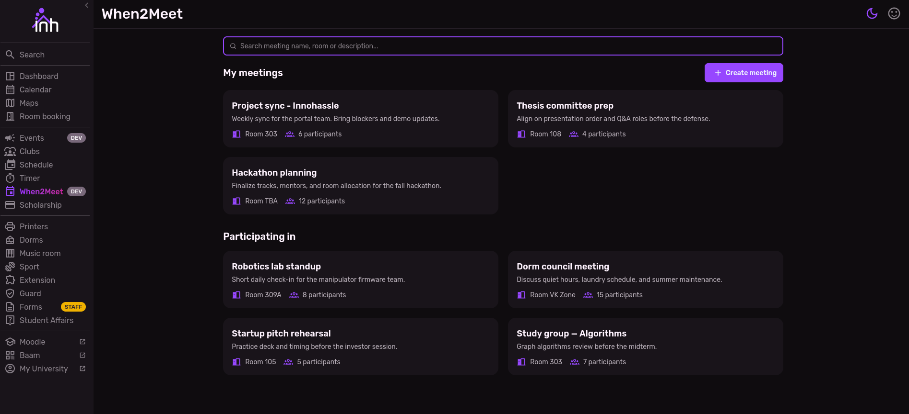
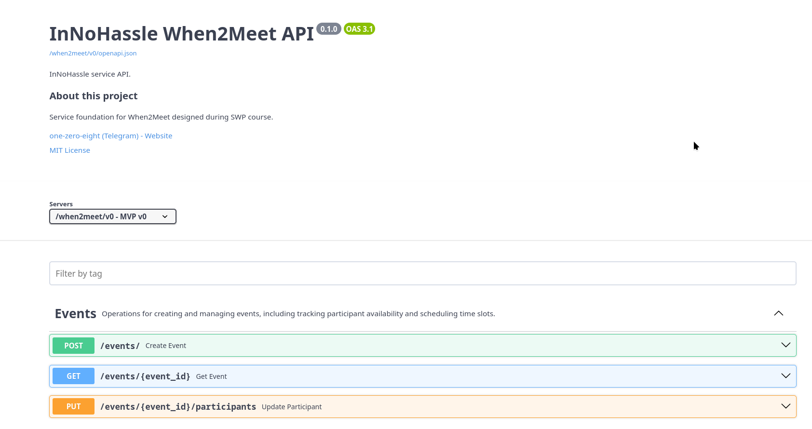

# Week 2 Report — When2Meet

InNoHassle service for planning meeting availability (SWP Assignment 2).

- **License:** [MIT License](https://github.com/one-zero-eight/monorepo/blob/main/LICENSE)
- **Repository:** [one-zero-eight/monorepo](https://github.com/one-zero-eight/monorepo) — `src/when2meet/`
- **MIT development model:** Customer agreed to public MIT development in the existing InnoHassle monorepo (see [customer-meeting-summary.md](customer-meeting-summary.md)).

## Assignment 2 artifacts

| Artifact | Link |
| --- | --- |
| User stories | [user-stories.md](user-stories.md) |
| MVP v0 report | [mvp-v0-report.md](mvp-v0-report.md) |
| Customer meeting summary | [customer-meeting-summary.md](customer-meeting-summary.md) |
| Customer meeting transcript | [customer-meeting-transcript.md](customer-meeting-transcript.md) |
| Week analysis | [analysis.md](analysis.md) |
| LLM usage report | [llm-report.md](llm-report.md) |

## Interface prototype

### Graphical interface (primary)

Mobile web UI — main user-facing interface for MVP v1.

| Artifact | Link |
| --- | --- |
| Figma prototype (view) | [Figma — When2Meet mobile mockup](https://www.figma.com/design/Q31P4ba6YlmTOzoXC3W3E7/Untitled?node-id=0-1&t=8UaoXVNW08qHuwuY-1) |
| Hosted frontend | [https://pre.innohassle.ru/when-to-meet](https://pre.innohassle.ru/when-to-meet) |

### API interface (supporting)

REST API consumed by the frontend; documented and runnable locally.

| Artifact | Link |
| --- | --- |
| OpenAPI specification | [api/openapi.yaml](../../api/openapi.yaml) |
| Interface documentation | [docs/interface.md](../../docs/interface.md) |
| Postman collection (repository) | [api/postman_collection.json](../../api/postman_collection.json) |
| Swagger UI (hosted) | [api.innohassle.ru/when2meet/v0/docs](https://api.innohassle.ru/when2meet/v0/docs) |
| Swagger UI (local) | `http://localhost:8020/docs` when running backend locally |
| Postman workspace (public view-only) | [Postman — when2meet](https://www.postman.com/dofi4ka/when2meet) |

## MVP v0

| Item | Link |
| --- | --- |
| Report | [mvp-v0-report.md](mvp-v0-report.md) |
| Hosted frontend | [https://pre.innohassle.ru/when-to-meet](https://pre.innohassle.ru/when-to-meet) |
| Hosted API / Swagger | [https://api.innohassle.ru/when2meet/v0/docs](https://api.innohassle.ru/when2meet/v0/docs) |
| Backend (local) | `http://localhost:8020` — see [mvp-v0-report.md](mvp-v0-report.md#local-setup) |
| Video demonstration (< 2 min) | [Yandex Disk](https://disk.yandex.ru/i/NtGKNllihRGJ4Q) |
| Local setup | [Root README](../../../../README.md#development) |

## Repository workflow

| Item | Link |
| --- | --- |
| PR/MR template | [pull_request_template.md](https://github.com/one-zero-eight/monorepo/blob/main/.github/pull_request_template.md) |
| Example reviewed PR/MR | [images/evidence-of-git-workflow.png](images/evidence-of-git-workflow.png) |
| Lychee workflow config | [lychee.yaml](https://github.com/one-zero-eight/monorepo/blob/main/.github/workflows/lychee.yaml) |
| Latest successful Lychee run (default branch) | [Actions run #27504812990](https://github.com/one-zero-eight/monorepo/actions/runs/27504812990/job/81294008662) |

### Excluded Lychee links

Links excluded from automated checking in [lychee.yaml](https://github.com/one-zero-eight/monorepo/blob/main/.github/workflows/lychee.yaml). Each was opened manually in a browser before submission.

| URL / pattern | Reason | Manually verified |
| --- | --- | --- |
| `*.innohassle.ru` (workflow regex) | InnoHassle services are not reliably reachable outside Russia; GitHub Actions cannot check them | Yes — `pre.innohassle.ru/when-to-meet` and `api.innohassle.ru/when2meet/v0/docs` load from Russia |
| `http://localhost:8020` | Local dev server | Yes — Swagger loads when service runs |
| `http://localhost:8020/docs` | Local Swagger UI | Yes |
| `https://disk.yandex.ru/i/NtGKNllihRGJ4Q` | Video host; may be slow for CI | Yes — video plays |

## Screenshots

| Screenshot | File | Status |
| --- | --- | --- |
| Reviewed PR/MR | [evidence-of-git-workflow.png](images/evidence-of-git-workflow.png) | Done |
| Protected default branch | [evidence-of-protected-default-branch.png](images/evidence-of-protected-default-branch.png) | Done |
| Deployed MVP v0 frontend | [evidence-of-deployed-mvp-v0.png](images/evidence-of-deployed-mvp-v0.png) | Done |
| API / Swagger prototype | [evidence-of-swagger.png](images/evidence-of-swagger.png) | Done |
| Figma prototype | Figma link above or `images/evidence-of-figma.png` | Optional |

## Moodle PDF (Typst)

Sources: [pdf/week2-report.typ](pdf/week2-report.typ) — compile instructions in [pdf/README.md](pdf/README.md).

## Coverage

### Initial proposed MVP v1 scope

**US-001**, **US-002**, **US-003**, **US-006** — see [user-stories.md](user-stories.md#initial-proposed-mvp-v1-scope).

### Prototype coverage (Figma + hosted frontend)

| Story IDs | What the prototype shows |
| --- | --- |
| US-001 | Create meeting, name, calendar day and time-slot selection |
| US-002 | Shareable meeting link flow (UI level) |
| US-003 | Participant opens link and marks availability |
| US-006 | Aggregated responses / heat-map style results view |
| US-004, US-007 | Discussed with customer; screens not complete |
| US-005 | MEOW button — excluded (Won't Have) |
| US-008–US-010 | Not in prototype yet |

Open meetings and meeting-password flows were **removed** from the prototype after customer review (not separate user stories in the current backlog).

### API / MVP v0 backend coverage

| Story IDs | Implementation |
| --- | --- |
| US-001 | `POST /api/v0/events/` |
| US-003 | `PUT /api/v0/events/{id}/participants` |
| US-006 | `GET /api/v0/events/{id}` — data for aggregation / heat map |
| US-002, US-004, US-007–US-010 | Not implemented in API v0 |

Smoke checks: [mvp-v0-report.md#smoke-check](mvp-v0-report.md#smoke-check).

## Customer meeting documentation

- Summary: [customer-meeting-summary.md](customer-meeting-summary.md)
- Transcript (published): [customer-meeting-transcript.md](customer-meeting-transcript.md)
- Customer meeting notes: not used (recording and sharing permitted)
