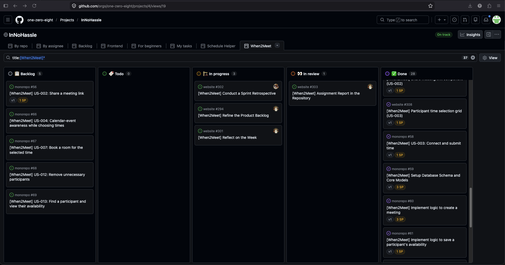
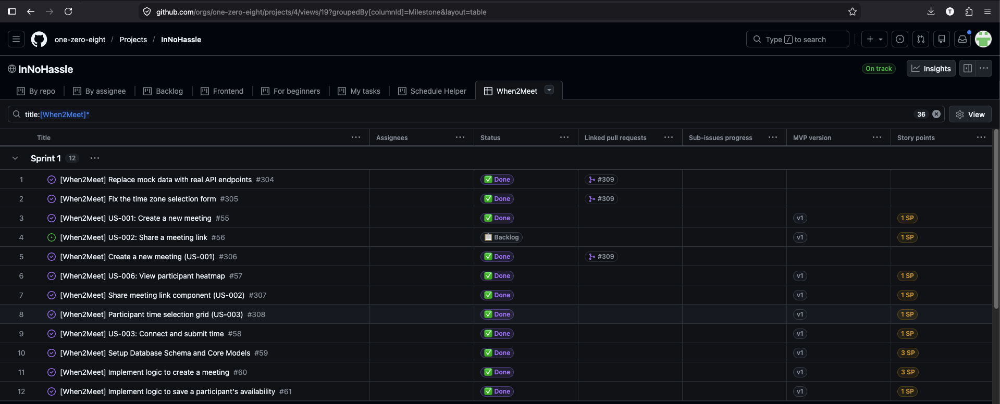
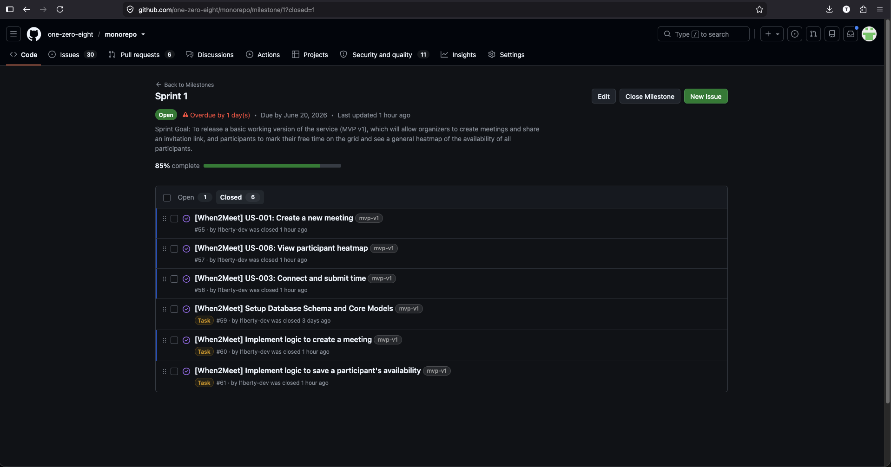
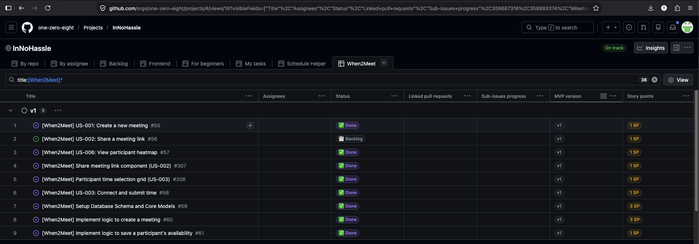
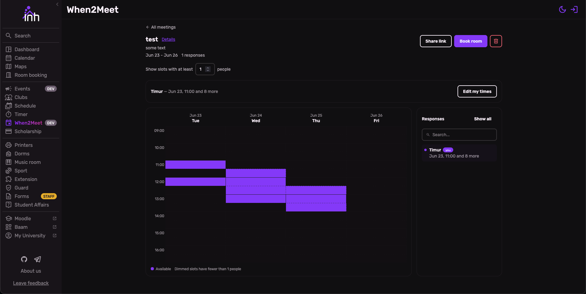
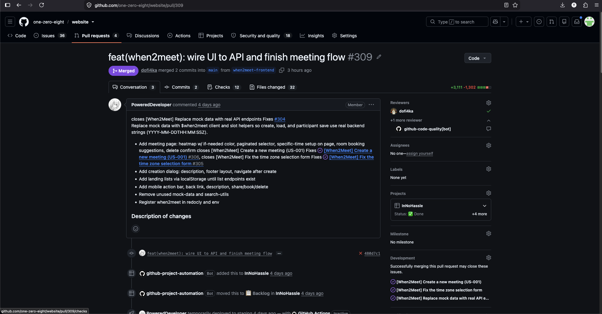

# Week 3 Report — When2Meet

InNoHassle service for planning meeting availability (SWP Assignment 3).

- **License:** [MIT License](https://github.com/one-zero-eight/monorepo/blob/main/LICENSE)
- **Repository:** [one-zero-eight/monorepo](https://github.com/one-zero-eight/monorepo) — `src/when2meet/`
- **Frontend:** [one-zero-eight/website](https://github.com/one-zero-eight/website) (`/when2meet` routes)

## Scope since Assignment 2

User stories migrated from [week2/user-stories.md](../week2/user-stories.md) into GitHub Issues. Current registry: [docs/user-stories.md](../../docs/user-stories.md).

| Change | Detail |
| --- | --- |
| MVP v1 user stories | US-001, US-002, US-003, US-006 (+ supporting PBIs) |
| New stories (Sprint 2) | US-012, US-013 from customer review themes |
| Deferred | US-004, US-007 planned for Sprint 2; US-008–US-010 not yet issued |
| Won't Have | US-005 unchanged |

### Week 2 customer feedback addressed in MVP v1

| Week 2 feedback | MVP v1 response |
| --- | --- |
| Mobile-first scheduling UI | Deployed at [pre.innohassle.ru/when2meet](https://pre.innohassle.ru/when2meet) |
| No link passwords; InnoHassle identity | Partial — SSO enforcement deferred; manual participant entry still present |
| Heat map / aggregated responses (US-006) | Heatmap with tooltips and search shipped; gradient “Best time” rejected in Sprint Review |
| Shareable link flow (US-002) | Share dialog and link UI ([#307](https://github.com/one-zero-eight/website/issues/307)); parent [#56](https://github.com/one-zero-eight/monorepo/issues/56) open pending SSO join |
| Calendar / room booking deferred | Remains Sprint 2 ([#66](https://github.com/one-zero-eight/monorepo/issues/66), [#67](https://github.com/one-zero-eight/monorepo/issues/67)) |

## Backlog and Sprint tracking

| View | Link |
| --- | --- |
| Product Backlog (InNoHassle → **When2Meet** tab) | [GitHub Project #4](https://github.com/orgs/one-zero-eight/projects/4) |
| Sprint Backlog (Sprint 1 / milestone filter) | [Project — Sprint 1 group](https://github.com/orgs/one-zero-eight/projects/4) (see screenshot) |
| Sprint 1 milestone (goal, dates, scope) | [milestone/1](https://github.com/one-zero-eight/monorepo/milestone/1) |
| MVP v1 scope (`mvp-v1` / MVP version field) | [Project — v1 group](https://github.com/orgs/one-zero-eight/projects/4) (see screenshot) |
| Historical user stories (Assignment 2) | [week2/user-stories.md](../week2/user-stories.md) |
| Current user-story index | [docs/user-stories.md](../../docs/user-stories.md) |

**Total Product Backlog size:** 23 story points across 16 qualifying PBIs (11 monorepo + 5 website; excludes Course Tasks and US-005 Won't Have).

**Sprint 1 size:** 14 story points completed of ~15 planned (US-002 parent story [#56](https://github.com/one-zero-eight/monorepo/issues/56) still open; supporting UI done).

## MVP v1 scope

PBIs labeled `mvp-v1` / MVP version **v1** on the project board:

| Type | Items |
| --- | --- |
| User stories | [#55](https://github.com/one-zero-eight/monorepo/issues/55) US-001, [#56](https://github.com/one-zero-eight/monorepo/issues/56) US-002, [#58](https://github.com/one-zero-eight/monorepo/issues/58) US-003, [#57](https://github.com/one-zero-eight/monorepo/issues/57) US-006 |
| Backend tasks | [#59](https://github.com/one-zero-eight/monorepo/issues/59)–[#61](https://github.com/one-zero-eight/monorepo/issues/61) |
| Frontend tasks | [website#304](https://github.com/one-zero-eight/website/issues/304)–[#308](https://github.com/one-zero-eight/website/issues/308) |

**Sprint Goal** (from [milestone/1](https://github.com/one-zero-eight/monorepo/milestone/1)): release a basic working MVP v1 — create meeting, share invitation link, mark availability, view heatmap.

### Workflow semantics

- **PBI types:** User Story, Other PBI (tasks/integration), Bug Report — see [issue templates](https://github.com/one-zero-eight/monorepo/tree/main/.github/ISSUE_TEMPLATE).
- **Work Status:** `To Do` → `Ready` → `In Progress` → `Review` → `Done` (canonical course values).
- **Sprint container:** issues assigned to the Sprint milestone ([Sprint 1](https://github.com/one-zero-eight/monorepo/milestone/1)).
- **MVP version:** `mvp-v1` label + project **MVP version** field (`v1`).
- **Decomposition:** user stories split into monorepo backend PBIs and website frontend PBIs; frontend work links to parent US via title and project grouping.

## Roadmap

Sprint 1 delivered MVP v1 core flows; Sprint 2 targets SSO, calendar context, room booking, and participant management. Details: [docs/roadmap.md](../../docs/roadmap.md).

## MVP v1 verification evidence

| PBI | Evidence |
| --- | --- |
| US-001 / UI | [website PR #309](https://github.com/one-zero-eight/website/pull/309) closes [#306](https://github.com/one-zero-eight/website/issues/306); [#55](https://github.com/one-zero-eight/monorepo/issues/55) closed |
| US-003 | PR #309 closes [#308](https://github.com/one-zero-eight/website/issues/308); [#58](https://github.com/one-zero-eight/monorepo/issues/58) closed |
| US-006 | [#57](https://github.com/one-zero-eight/monorepo/issues/57) closed; heatmap in PR #309 |
| US-002 (partial) | [#307](https://github.com/one-zero-eight/website/issues/307) closed; [#56](https://github.com/one-zero-eight/monorepo/issues/56) open |
| API integration | PR #309 closes [#304](https://github.com/one-zero-eight/website/issues/304), [#305](https://github.com/one-zero-eight/website/issues/305) |
| Backend | [#59](https://github.com/one-zero-eight/monorepo/issues/59)–[#61](https://github.com/one-zero-eight/monorepo/issues/61) merged on `main` |
| Deployed increment | [pre.innohassle.ru/when2meet](https://pre.innohassle.ru/when2meet) |
| Demo video (< 2 min) | [Yandex Disk](https://disk.yandex.ru/i/a8Fd8-wO2qHsXQ) |

## Product status

MVP v1 core flows are usable on staging: create a meeting, open share UI, enter participant availability, view heatmap. Customer Sprint Review (20 June 2026) requested SSO-linked participants, clearer “Specific time” UX, and a numeric heatmap filter instead of the “Best time” gradient. **US-002** remains open until share-link join with SSO is verified.

## Next steps

1. Sprint 2: SSO integration and close [#56](https://github.com/one-zero-eight/monorepo/issues/56).
2. Replace “Best time” gradient with maximum-intersection filter.
3. Migrate US-008–US-010 to issues; continue Sprint 2 items in [docs/roadmap.md](../../docs/roadmap.md).
4. Create course SemVer tag `when2meet-v1.0.0` on `main` (see [CHANGELOG.md](../../CHANGELOG.md)) — pending; customer prefers no InnoHassle product versioning, but course requires one mapped release.

## Release and changelog

| Item | Link |
| --- | --- |
| Changelog | [CHANGELOG.md](../../CHANGELOG.md) |
| SemVer release (planned) | `when2meet-v1.0.0` — **create before Moodle submission**; screenshot placeholder below |

## Process and quality

| Item | Link |
| --- | --- |
| Definition of Done | [docs/definition-of-done.md](../../docs/definition-of-done.md) |
| PR/MR template | [pull_request_template.md](https://github.com/one-zero-eight/monorepo/blob/main/.github/pull_request_template.md) |
| Issue templates | [.github/ISSUE_TEMPLATE/](https://github.com/one-zero-eight/monorepo/tree/main/.github/ISSUE_TEMPLATE) |

### Reviewed issue-linked PRs/MRs (Week 3 evidence)

| PR | Repository | Summary |
| --- | --- | --- |
| [#309](https://github.com/one-zero-eight/website/pull/309) | website | Wire When2Meet UI to API (closes #304–#306) |
| [#70](https://github.com/one-zero-eight/monorepo/pull/70) | monorepo | Week 3 screenshots |
| [#65](https://github.com/one-zero-eight/monorepo/pull/65) | monorepo | Roadmap |

## Delivered MVP v1 access

| Artifact | Link |
| --- | --- |
| Hosted frontend | [https://pre.innohassle.ru/when2meet](https://pre.innohassle.ru/when2meet) |
| Run instructions | [Root README](../../../../README.md#development) (`uv run -m src.when2meet --reload`, port 8020) |
| API docs (hosted) | [api.innohassle.ru/when2meet/v0/docs](https://api.innohassle.ru/when2meet/v0/docs) |
| Demo video | [Yandex Disk](https://disk.yandex.ru/i/a8Fd8-wO2qHsXQ) |
| Test credentials | Not required for current staging flows |

## Customer Sprint Review

| Artifact | Link |
| --- | --- |
| Summary | [customer-review-summary.md](customer-review-summary.md) |
| Transcript (public) | [customer-review-transcript.md](customer-review-transcript.md) |
| Recording | Instructor-only — [Yandex Disk](https://disk.yandex.ru/d/NiTpSlSeKggsUg) (not in repository) |

## Week 3 artifacts

| Artifact | Link |
| --- | --- |
| Reflection | [reflection.md](reflection.md) |
| Retrospective | [retrospective.md](retrospective.md) |
| LLM usage | [llm-report.md](llm-report.md) |
| Week 2 report | [week2/README.md](../week2/README.md) |

## Screenshots

| Screenshot | File |
| --- | --- |
| Product Backlog view | [product-backlog-view.png](images/product-backlog-view.png) |
| Sprint Backlog view | [sprint-backlog-view.png](images/sprint-backlog-view.png) |
| Sprint milestone | [sprint-milestone.png](images/sprint-milestone.png) |
| MVP v1 version view | [mvp-version-field-filtered.png](images/mvp-version-field-filtered.png) |
| Delivered MVP v1 | [delivered-mvp-v1.png](images/delivered-mvp-v1.png) |
| Reviewed issue-linked PR | [reviewed-issue-linked-MR.png](images/reviewed-issue-linked-MR.png) |
| SemVer release | *Pending — add `semver-release.png` after tag `when2meet-v1.0.0` is created* |

## Repository workflow

| Item | Link |
| --- | --- |
| Lychee config | [lychee.yaml](https://github.com/one-zero-eight/monorepo/blob/main/.github/workflows/lychee.yaml) |

### Excluded Lychee links

| URL / pattern | Reason |
| --- | --- |
| `*.innohassle.ru` | Not reliably reachable outside Russia from GitHub Actions |
| `https://disk.yandex.ru/*` | Video/recording host |
| `http://localhost:8020` | Local dev server |

## Moodle PDF (Typst)

Sources: [pdf/week3-report.typ](pdf/week3-report.typ) — compile instructions in [pdf/README.md](pdf/README.md).
