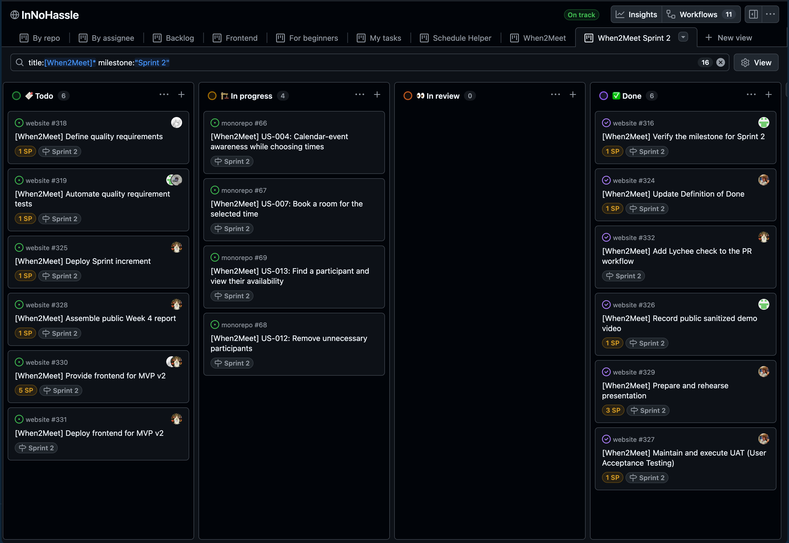
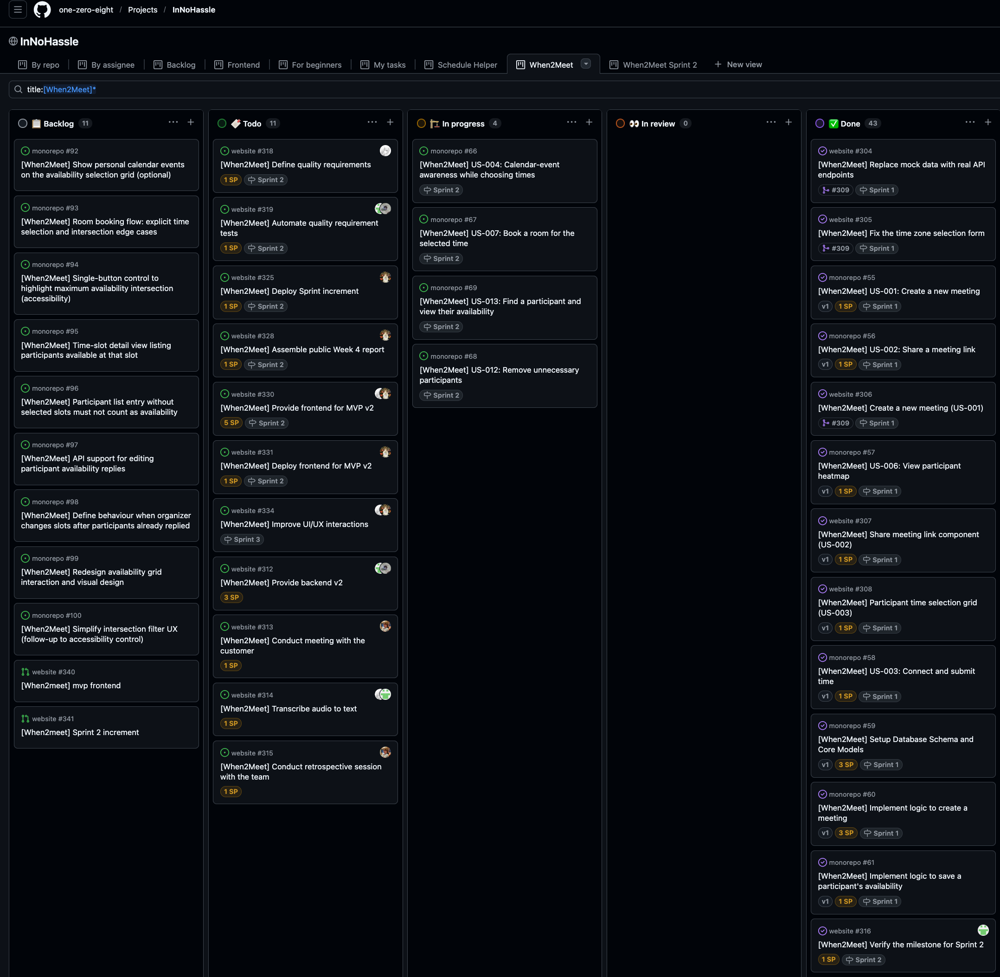
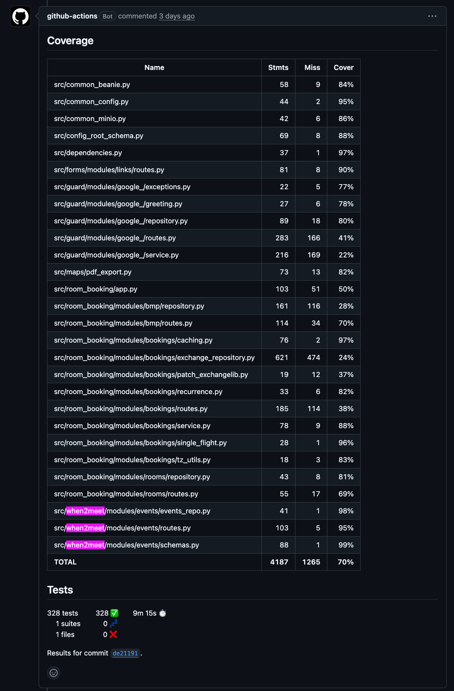
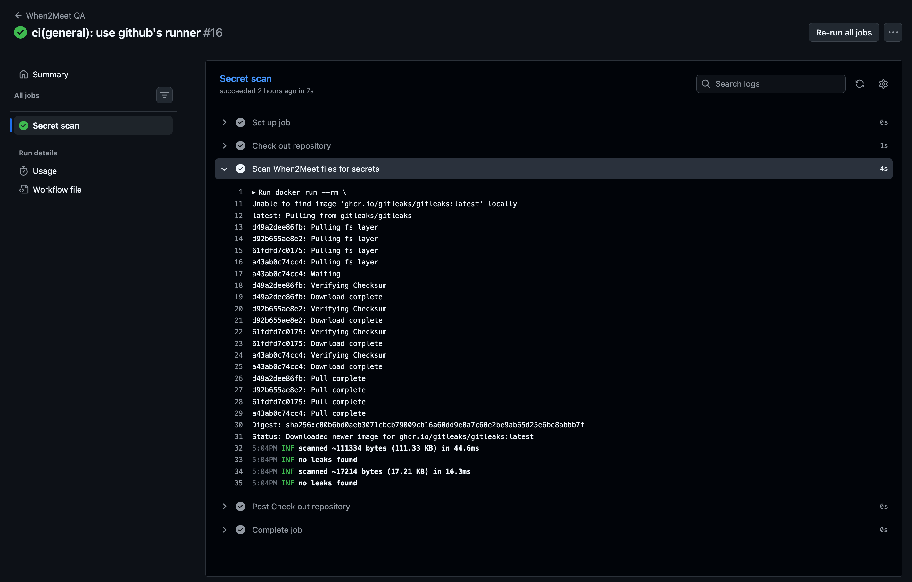
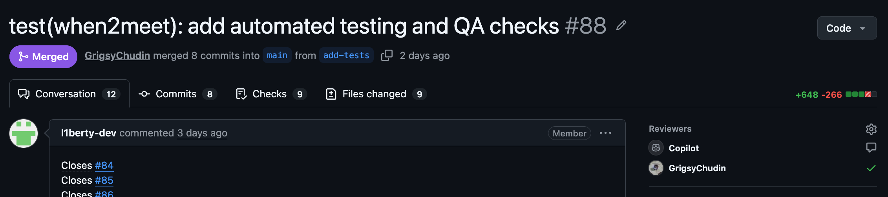
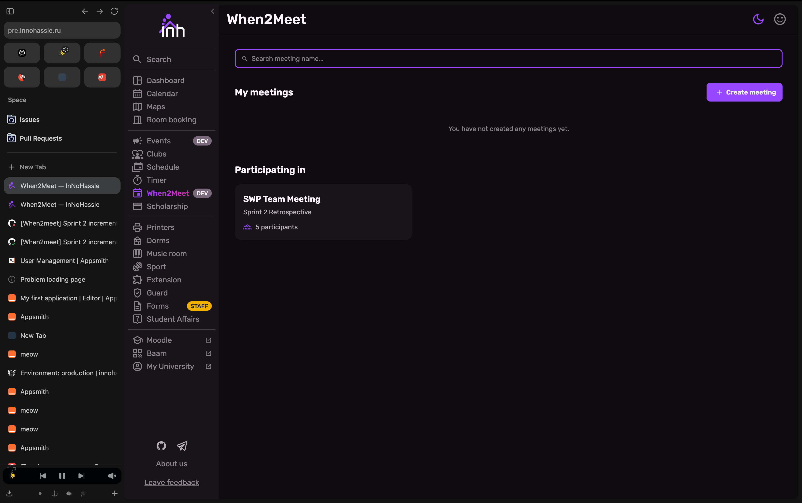
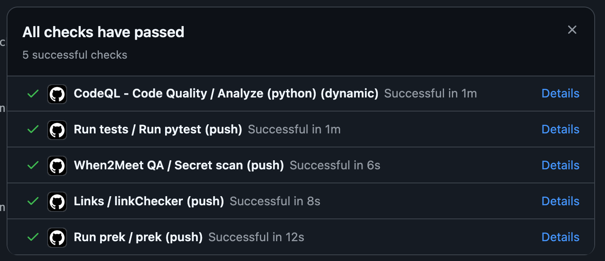

# Week 4 Report — When2Meet

InNoHassle service for planning meeting availability (SWP Assignment 4 / Sprint 2).

- **License:** [MIT License](https://github.com/one-zero-eight/monorepo/blob/main/LICENSE)
- **Repository:** [one-zero-eight/monorepo](https://github.com/one-zero-eight/monorepo) — `src/when2meet/`
- **Submission commit:** [`f78ac68`](https://github.com/one-zero-eight/monorepo/commit/f78ac681140982d5b3c12fd68218ad624e02805e) on `main`

## Sprint 2 summary


| Item                   | Value                                                                                                  |
| ---------------------- | ------------------------------------------------------------------------------------------------------ |
| **Sprint Goal**        | Improve scheduling decisions with calendar awareness and organizer controls                            |
| **Dates**              | 22 June 2026 – 28 June 2026 (Week 4)                                                                   |
| **Sprint milestone**   | [Sprint 2](https://github.com/one-zero-eight/monorepo/milestone/2)                                     |
| **Total Story Points** | 38                                                                                                     |
| **Scope summary**      | Calendar-aware scheduling groundwork, participant management, room booking UI, automated quality gates |


### Workflow links


| Item                         | Link                                                                                   |
| ---------------------------- | -------------------------------------------------------------------------------------- |
| Product Backlog board        | [GitHub Project view 19](https://github.com/orgs/one-zero-eight/projects/4/views/19) |
| Sprint Backlog board / table | [GitHub Project view 20](https://github.com/orgs/one-zero-eight/projects/4/views/20) |
| Sprint milestone             | [Sprint 2](https://github.com/one-zero-eight/monorepo/milestone/2)                   |
| Roadmap                      | [docs/roadmap.md](../../docs/roadmap.md)                                               |


### Delivered product changes (Sprint increment)

- Event creation with two time-selection modes and restored optional description.
- Short slug-based share links and working SSO redirect with profile fields.
- Meeting deletion and owned **My meetings** list.
- Calendar export from app to user calendar.
- Participant search on the meeting grid (UAT passed).
- Initial room booking modal (partial — time-selection logic incomplete).
- Automated tests, coverage on critical event modules, secret-scan QA check, and documented quality requirements/QRTs.

### Deployment and run instructions


| Item                      | Link                                                                                       |
| ------------------------- | ------------------------------------------------------------------------------------------ |
| Hosted frontend           | [https://pre.innohassle.ru/when2meet](https://pre.innohassle.ru/when2meet)                 |
| Hosted API / Swagger      | [https://api.innohassle.ru/when2meet/v0/docs](https://api.innohassle.ru/when2meet/v0/docs) |
| Root development setup    | [monorepo README](../../../../README.md#development)                                       |
| Interface documentation   | [docs/interface.md](../../docs/interface.md)                                               |


### Public demo video (< 2 min)

[Yandex Disk — Sprint 2 sanitized demo](https://disk.yandex.ru/i/QcdKlW0IIW_yDg)

## Customer feedback response

Issue drafts (created on GitHub): [customer-feedback-issues.md](customer-feedback-issues.md).


| Feedback point                                                | Resulting PBI or issue                                        | Status  | Response                                     |
| ------------------------------------------------------------- | ------------------------------------------------------------- | ------- | -------------------------------------------- |
| Link sharing with short slugs                                 | Sprint 2 delivery                                             | Done    | Delivered and approved in Sprint Review      |
| SSO redirect and profile fields                               | Sprint 2 delivery                                             | Done    | Delivered and approved                       |
| Meeting deletion                                              | Sprint 2 delivery                                             | Done    | Delivered and approved                       |
| Past meetings should disappear (no archive tab)               | Product decision                                              | Done    | Accepted; no separate archive tab            |
| Calendar export to user calendar                              | Sprint 2 delivery                                             | Done    | Export works; reverse overlay deferred       |
| UI awkward; slot self-selection inconvenient                  | [#99](https://github.com/one-zero-eight/monorepo/issues/99)   | Backlog | UI redesign tracked as technical debt        |
| Participant without selected time must not count as answer    | [#96](https://github.com/one-zero-eight/monorepo/issues/96)   | Backlog | Business rule change needed                  |
| Minimum-participant filter not user-friendly                  | [#100](https://github.com/one-zero-eight/monorepo/issues/100) | Backlog | Replace with single intersection control     |
| Reverse calendar overlay while selecting slots                | [#92](https://github.com/one-zero-eight/monorepo/issues/92)   | Backlog | Deferred from Sprint 2; UAT-001 not executed |
| Room booking must ask explicit time; handle 0/N intersections | [#93](https://github.com/one-zero-eight/monorepo/issues/93)   | Partial | Modal works; logic incomplete (UAT partial)  |
| Colorblind-friendly max-intersection button                   | [#94](https://github.com/one-zero-eight/monorepo/issues/94)   | Backlog | Accessibility follow-up                      |
| Click slot to see participant names                           | [#95](https://github.com/one-zero-eight/monorepo/issues/95)   | Backlog | Detail view requested                        |
| Edit participant replies (missing backend endpoint)           | [#97](https://github.com/one-zero-eight/monorepo/issues/97)   | Blocked | Coordinate with backend team                 |
| Slot grid edits after replies exist (migration)               | [#98](https://github.com/one-zero-eight/monorepo/issues/98)   | Backlog | Policy spike required                        |


**Feedback not addressed in Sprint 2:** tracked in [#92](https://github.com/one-zero-eight/monorepo/issues/92)–[#100](https://github.com/one-zero-eight/monorepo/issues/100) for the next Sprint.

## Quality model and requirements

**Model:** ISO/IEC 25010 quality sub-characteristics.


| QR                                                                              | Sub-characteristic | Summary                                            |
| ------------------------------------------------------------------------------- | ------------------ | -------------------------------------------------- |
| [QR-001](../../docs/quality-requirements.md#qr-001-critical-module-testability) | Testability        | Critical event modules maintain ≥30% line coverage |
| [QR-002](../../docs/quality-requirements.md#qr-002-owner-only-event-mutation)   | Confidentiality    | Non-owners cannot patch/delete events              |
| [QR-003](../../docs/quality-requirements.md#qr-003-event-read-response-time)    | Time behaviour     | Event `GET` completes within 2s in CI              |


- [docs/quality-requirements.md](../../docs/quality-requirements.md)
- [docs/quality-requirement-tests.md](../../docs/quality-requirement-tests.md)
- [docs/definition-of-done.md](../../docs/definition-of-done.md)

## Testing status

Canonical detail: [docs/testing.md](../../docs/testing.md).

### Critical modules and coverage


| Critical module                 | Why critical                     | Required | Current (local `pytest --cov`) |
| ------------------------------- | -------------------------------- | -------- | ------------------------------ |
| `modules/events/routes.py`      | Public API, authz, contracts     | 30%      | 95%                            |
| `modules/events/events_repo.py` | Persistence, slugs, participants | 30%      | 98%                            |
| `modules/events/schemas.py`     | Request/response normalization   | 30%      | 99%                            |


Command:

```bash
uv run -m pytest tests/when2meet --cov=src/when2meet --cov-report=term-missing
```

Monorepo-wide coverage may be lower when only When2Meet tests run.

### Test locations


| Type              | Location                                                                                                                                                   |
| ----------------- | ---------------------------------------------------------------------------------------------------------------------------------------------------------- |
| Unit tests        | [tests/when2meet/test_event_schemas.py](../../../../tests/when2meet/test_event_schemas.py)                                                                    |
| Integration tests | [tests/when2meet/test_events.py](../../../../tests/when2meet/test_events.py), [test_when2meet_startup.py](../../../../tests/when2meet/test_when2meet_startup.py) |
| Automated QRTs    | [tests/when2meet/test_quality_requirements.py](../../../../tests/when2meet/test_quality_requirements.py)                                                      |


### Additional QA check

**Selected check:** When2Meet secret scanning (gitleaks) — distinct from lint, tests, coverage, QRTs, and Lychee.


| Item               | Detail                                                                                                       |
| ------------------ | ------------------------------------------------------------------------------------------------------------ |
| Objective          | Prevent committed API tokens, JWTs, and credentials in When2Meet paths                                       |
| CI workflow        | [when2meet-qa.yaml](../../../../.github/workflows/when2meet-qa.yaml) job `Secret scan`                          |
| Options considered | OpenAPI drift, dependency audit, license scan, container scan — see [docs/testing.md](../../docs/testing.md) |
| Limitations        | Does not prove frontend/browser compatibility or deployed-environment contract drift                         |


## CI and branch protection


| Item                            | Link                                                                                                                              |
| ------------------------------- | --------------------------------------------------------------------------------------------------------------------------------- |
| CI pipeline (pytest + coverage) | [tests.yaml](../../../../.github/workflows/tests.yaml)                                                                               |
| Additional QA (secret scan)     | [when2meet-qa.yaml](../../../../.github/workflows/when2meet-qa.yaml)                                                                 |
| Link checking                   | [lychee.yaml](../../../../.github/workflows/lychee.yaml)                                                                             |
| Latest passing tests job        | [Run tests #28267305034](https://github.com/one-zero-eight/monorepo/actions/runs/28267305034/job/83756940196)                      |
| Latest passing secret scan job  | [When2Meet QA #28267305006](https://github.com/one-zero-eight/monorepo/actions/runs/28267305006/job/83756939812)                   |
| Latest passing link check job   | [Lychee #28267305019](https://github.com/one-zero-eight/monorepo/actions/runs/28267305019/job/83756939927)                         |
| Example reviewed PR             | [#88](https://github.com/one-zero-eight/monorepo/pull/88)                                                                         |


**Continuing governance:** Assignment 4 pytest suites, coverage expectations on critical modules, QRTs, secret scanning, and the updated Definition of Done remain required for later PBIs unless replaced with documented stronger checks.

## UAT summary (public, sanitized)

Full scenarios: [docs/user-acceptance-tests.md](../../docs/user-acceptance-tests.md).


| UAT                        | Result (2026-06-27) | Follow-up                                                   |
| -------------------------- | ------------------- | ----------------------------------------------------------- |
| UAT-001 Calendar overlay   | Not executed        | [#92](https://github.com/one-zero-eight/monorepo/issues/92) |
| UAT-002 Participant search | Passed (search)     | [#96](https://github.com/one-zero-eight/monorepo/issues/96) |
| UAT-003 Room booking       | Partial             | [#93](https://github.com/one-zero-eight/monorepo/issues/93) |


Private customer UAT recording: Moodle submission only (not in this repository).

## Sprint events and Week 4 artifacts


| Artifact                       | Link                                                                                                                  |
| ------------------------------ | --------------------------------------------------------------------------------------------------------------------- |
| Customer review summary        | [customer-review-summary.md](customer-review-summary.md)                                                              |
| Customer review transcript     | Skipped for public repo — recording submitted via Moodle                                                              |
| Sprint retrospective           | [retrospective.md](retrospective.md)                                                                                  |
| Week reflection                | [reflection.md](reflection.md)                                                                                        |
| LLM usage report               | [llm-report.md](llm-report.md)                                                                                        |
| Draft feedback issues          | [customer-feedback-issues.md](customer-feedback-issues.md)                                                            |
| Presentation slides (external) | [Google Slides](https://docs.google.com/presentation/d/13dyS33eQJj3EYIsjgGx3esRw8aiWcjPSPp3x0VwqTHg/edit?usp=sharing) |


Rehearsed presentation video: Moodle submission only ([link](https://disk.yandex.ru/i/EHwGq5F69xCz1g) — not committed).

## Product status and next steps

**Current status:** Sprint 2 increment is deployed and customer-tested. Core sharing, SSO, and deletion are approved. Scheduling UX, room-booking time logic, reverse calendar overlay, and accessibility improvements remain open.

**Next steps:** Prioritize [#92](https://github.com/one-zero-eight/monorepo/issues/92)–[#100](https://github.com/one-zero-eight/monorepo/issues/100); re-run deferred UAT scenarios.

## Contribution traceability (Sprint 2 — draft, edit as needed)


| Member              | Issues / PRs / reviews / testing / docs                                   |
| ------------------- | ------------------------------------------------------------------------- |
| Nikita Lisitskiy    | Sprint Planning; customer UAT facilitation; backlog refinement            |
| Vladislav Konovalov | CI/QA (`when2meet-qa.yaml`, `docs/testing.md`); deployment; Week 4 report |
| Mikhail Istomin     | Sprint increment demo; frontend Sprint features                           |
| Dmitrii Chudin      | Backend/API support for Sprint scope                                      |
| Timur Khasanov      | Demo video; transcript/summary drafting; link QA                          |


Sprint Review/UAT meeting attendees: customer, tester, developer demo lead, observer — other members did not join the recording.

## Screenshots

Sprint backlog evidence uses the same board as the Sprint milestone view ([view 20](https://github.com/orgs/one-zero-eight/projects/4/views/20)).

| Screenshot | File | Status |
|---|---|---|
| Sprint milestone / Sprint backlog | [sprint-milestone.png](images/sprint-milestone.png) | Done |
| Product backlog | [product-backlog.png](images/product-backlog.png) | Done |
| Coverage report | [coverage-report.png](images/coverage-report.png) | Done |
| Secret scan | [secret-scan-result.png](images/secret-scan-result.png) | Done |
| Reviewed PR | [reviewed-pr.png](images/reviewed-pr.png) | Done |
| Deployed product | [deployed-product.png](images/deployed-product.png) | Done |
| Branch protection | [week2 evidence](../week2/images/evidence-of-protected-default-branch.png) | Reused from Week 2 |
| Latest `main` CI | [latest-ci-run.png](images/latest-ci-run.png) | Done |

### Embedded screenshots
















## Moodle PDF

Typst sources: [pdf/week4-report.typ](pdf/week4-report.typ) — compile with [pdf/README.md](pdf/README.md).

Built PDF (local): `pdf/week4-report.pdf` — compiled for submission commit [`f78ac68`](https://github.com/one-zero-eight/monorepo/commit/f78ac681140982d5b3c12fd68218ad624e02805e).

Private items in PDF only: university emails, Sprint Review/UAT recording, sanitized transcript, rehearsed presentation video, participation attribution.