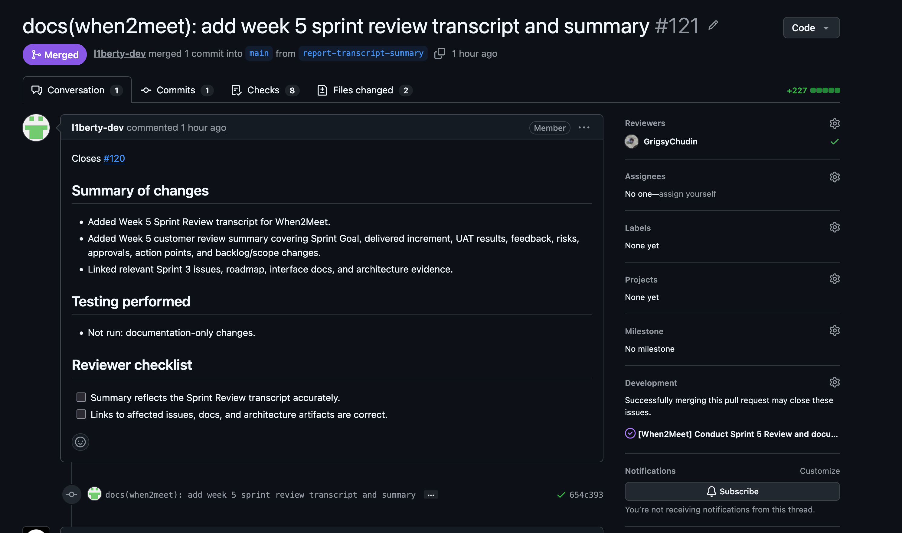
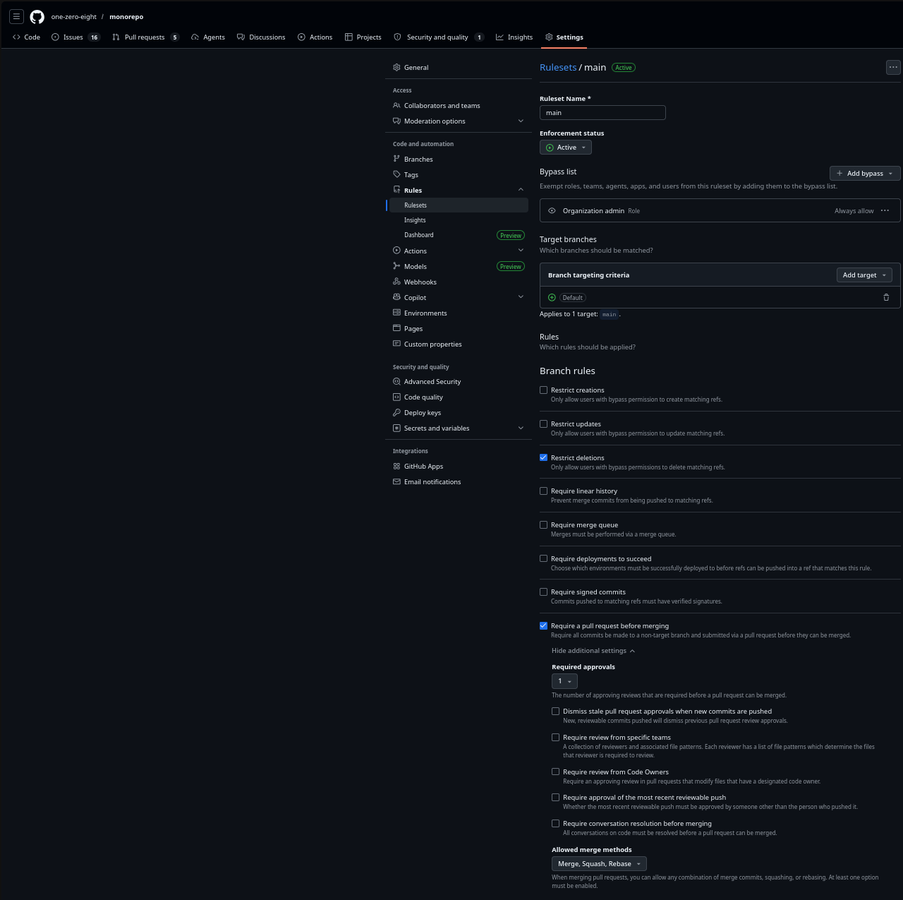

# Week 5 Report — When2Meet

InNoHassle service for planning meeting availability (SWP Assignment 5 / Sprint 3 / **MVP v2**).

- **License:** [MIT License](https://github.com/one-zero-eight/monorepo/blob/main/LICENSE)
- **Repository:** [one-zero-eight/monorepo](https://github.com/one-zero-eight/monorepo) — `src/when2meet/`
- **Submission commit:** [`be054fc32dcec0be905f68f5e3cdff6745028e4c`](https://github.com/one-zero-eight/monorepo/commit/be054fc32dcec0be905f68f5e3cdff6745028e4c) on `main`

## Sprint 3 summary

| Item | Value |
|---|---|
| **Sprint Goal** | Address Sprint Review and UAT feedback by improving availability selection, making intersections easier to understand, and completing participant reply editing behaviour |
| **Dates** | 29 June 2026 – 5 July 2026 (Week 5) |
| **Sprint milestone** | [Sprint 3](https://github.com/one-zero-eight/monorepo/milestone/3) |
| **Total Story Points** | 44 |
| **Scope summary** | Calendar overlay, participant management, intersection/filter UX, heatmap room booking, slot-edit preservation, architecture docs, ADRs, development process, hosted docs, extended QA gates |

### Workflow links

| Item | Link |
|---|---|
| Product Backlog board | [GitHub Project view 19](https://github.com/orgs/one-zero-eight/projects/4/views/19) |
| Sprint Backlog board / table | [GitHub Project view 20](https://github.com/orgs/one-zero-eight/projects/4/views/20) |
| Sprint milestone | [Sprint 3](https://github.com/one-zero-eight/monorepo/milestone/3) |
| Roadmap | [docs/roadmap.md](../../docs/roadmap.md) |

### Delivered MVP v2 changes

- Personal calendar overlay during slot selection, including mobile event details ([#92](https://github.com/one-zero-eight/monorepo/issues/92)).
- Participant search, individual availability filtering, and owner-side participant removal ([#95](https://github.com/one-zero-eight/monorepo/issues/95), [US-012](https://github.com/one-zero-eight/monorepo/issues?q=is%3Aissue%20US-012), [US-013](https://github.com/one-zero-eight/monorepo/issues?q=is%3Aissue%20US-013)).
- Selected-slot border on the availability grid and minimum-participant filtering ([#99](https://github.com/one-zero-eight/monorepo/issues/99), [#100](https://github.com/one-zero-eight/monorepo/issues/100)).
- Heatmap room booking with free-room selection and reservation confirmation — **partial** at UAT ([#93](https://github.com/one-zero-eight/monorepo/issues/93)).
- Hidden-slot preservation when organizers edit the grid ([#98](https://github.com/one-zero-eight/monorepo/issues/98) / [#106](https://github.com/one-zero-eight/monorepo/pull/106)).
- Maintained architecture views, ADRs 0001–0003, `docs/development-process.md`, GitHub Pages docs site, QR-004 / QRT-004 ([#108](https://github.com/one-zero-eight/monorepo/pull/108)).

### Deployment and run instructions

| Item | Link |
|---|---|
| Hosted frontend (React SPA) | [https://pre.innohassle.ru/when2meet](https://pre.innohassle.ru/when2meet) |
| Hosted API / Swagger | [https://api.innohassle.ru/when2meet/v0/docs](https://api.innohassle.ru/when2meet/v0/docs) |
| Root development setup | [monorepo README](../../../../README.md#development) |
| Interface documentation | [docs/interface.md](../../docs/interface.md) |
| Hosted documentation site | [https://one-zero-eight.github.io/monorepo/](https://one-zero-eight.github.io/monorepo/) |

### Public demo video (< 2 min)

[Yandex Disk — MVP v2 sanitized demo](https://disk.yandex.ru/i/HMPVXl3bnmYL0g)

## Customer feedback response

| Feedback point | Resulting PBI or issue | Status | Response |
|---|---|---|---|
| Reverse calendar overlay while selecting slots | [#92](https://github.com/one-zero-eight/monorepo/issues/92) | Done (refinement open) | Overlay delivered; hide-calendar toggle requested in Sprint Review |
| Room booking must ask explicit time; handle lifecycle | [#93](https://github.com/one-zero-eight/monorepo/issues/93) | Partial | Reservation works; booking state, optional flow, calendar link, and participant push remain open |
| Colorblind-friendly / clearer intersection UX | [#94](https://github.com/one-zero-eight/monorepo/issues/94), [#99](https://github.com/one-zero-eight/monorepo/issues/99) | Partial | Selected-slot border delivered; legend still requested |
| Click slot to see participant names | [#95](https://github.com/one-zero-eight/monorepo/issues/95) | Done | Search/filter and participant management demonstrated |
| Participant without selected time must not count | [#96](https://github.com/one-zero-eight/monorepo/issues/96) | Done | Empty replies excluded from heatmap logic |
| Edit participant replies via platform API | [#97](https://github.com/one-zero-eight/monorepo/issues/97) | Deferred | Cross-service endpoint still unavailable |
| Slot grid edits after replies exist | [#98](https://github.com/one-zero-eight/monorepo/issues/98) | Done | Hidden-slot preservation shipped in [#106](https://github.com/one-zero-eight/monorepo/pull/106) |
| UI awkward; slot self-selection inconvenient | [#99](https://github.com/one-zero-eight/monorepo/issues/99) | Partial | Border and booking-state clarity improved; legend and room selector styling remain |
| Minimum-participant filter not user-friendly | [#100](https://github.com/one-zero-eight/monorepo/issues/100) | Done | Filter demonstrated and accepted in Sprint Review |

**Feedback not addressed in Sprint 3:** [#97](https://github.com/one-zero-eight/monorepo/issues/97) remains deferred because reply editing depends on a platform endpoint outside the When2Meet service boundary.

## Architecture summary

Maintained artifact: [docs/architecture/README.md](../../docs/architecture/README.md)

| View | Artifact |
|---|---|
| Static (component) | [component-diagram.puml](../../docs/architecture/static-view/component-diagram.puml) · [SVG](../../docs/architecture/static-view/component-diagram.svg) |
| Dynamic (sequence) | [sequence-diagram.puml](../../docs/architecture/dynamic-view/sequence-diagram.puml) · [SVG](../../docs/architecture/dynamic-view/sequence-diagram.svg) |
| Deployment | [deployment-diagram.puml](../../docs/architecture/deployment-view/deployment-diagram.puml) · [SVG](../../docs/architecture/deployment-view/deployment-diagram.svg) |
| ADRs | [docs/architecture/adr/](../../docs/architecture/adr/) |

The product is delivered as a **React** SPA at `pre.innohassle.ru/when2meet` and a FastAPI service at `api.innohassle.ru/when2meet/v0`. ADR-0001 (repository pattern), ADR-0002 (slug lookup), and ADR-0003 (Accounts JWT + enrichment) support QR-001–QR-004 through testable boundaries and documented integration points.

## Quality model, testing, and CI

| QR | Sub-characteristic | Summary |
|---|---|---|
| [QR-001](../../docs/quality-requirements.md#qr-001-critical-module-testability) | Testability | Critical event modules maintain ≥30% line coverage |
| [QR-002](../../docs/quality-requirements.md#qr-002-owner-only-event-mutation) | Confidentiality | Non-owners cannot patch/delete events |
| [QR-003](../../docs/quality-requirements.md#qr-003-event-read-response-time) | Time behaviour | Event `GET` completes within 2s in CI |
| [QR-004](../../docs/quality-requirements.md#qr-004-qa-evidence-traceability) | Maintainability | QA/architecture docs stay navigable and linked to ADRs |

- [docs/definition-of-done.md](../../docs/definition-of-done.md)
- [docs/testing.md](../../docs/testing.md)
- [docs/quality-requirements.md](../../docs/quality-requirements.md)
- [docs/quality-requirement-tests.md](../../docs/quality-requirement-tests.md)
- [docs/user-acceptance-tests.md](../../docs/user-acceptance-tests.md)
- [docs/development-process.md](../../docs/development-process.md)

### CI status (latest `main`)

| Item | Link |
|---|---|
| CI pipeline (pytest + coverage) | [tests.yaml](../../../../.github/workflows/tests.yaml) |
| Additional QA (secret scan) | [when2meet-qa.yaml](../../../../.github/workflows/when2meet-qa.yaml) |
| Link checking | [lychee.yaml](../../../../.github/workflows/lychee.yaml) |
| Docs deploy | [when2meet-docs.yaml](../../../../.github/workflows/when2meet-docs.yaml) |
| Latest passing tests job | [Run tests #28745297066](https://github.com/one-zero-eight/monorepo/actions/runs/28745297066/job/85235060390) |
| Latest passing secret scan job | [When2Meet QA #28745297065](https://github.com/one-zero-eight/monorepo/actions/runs/28745297065/job/85235060450) |
| Latest passing link check job | [Lychee #28745297047](https://github.com/one-zero-eight/monorepo/actions/runs/28745297047/job/85235060357) |
| Example reviewed PR | [#119](https://github.com/one-zero-eight/monorepo/pull/119) |

## UAT summary (public, sanitized)

Full scenarios: [docs/user-acceptance-tests.md](../../docs/user-acceptance-tests.md).

| UAT | Result (2026-07-05) | Follow-up |
|---|---|---|
| UAT-001 Calendar overlay | Passed (change request) | Hide-calendar toggle |
| UAT-002 Participant search / filter | Passed (change request) | Participant names; deletion confirmation |
| UAT-003 Room booking | Partial | Booking lifecycle; calendar link; push to all participants |
| UAT-004 Selected-slot border | Passed (change request) | Legend for “my time” |
| UAT-005 Minimum-participant filter | Passed | Clearer booking-state messaging |

Private customer UAT + Sprint Review recording: Moodle submission only ([Yandex Disk](https://disk.yandex.ru/d/257aAbFwyBF3dQ) — not committed).

## Sprint events and Week 5 artifacts

| Artifact | Link |
|---|---|
| Sprint Review summary | [sprint-review-summary.md](sprint-review-summary.md) |
| Sprint Review transcript | [sprint-review-transcript.md](sprint-review-transcript.md) |
| Sprint retrospective | [retrospective.md](retrospective.md) |
| Week reflection | [reflection.md](reflection.md) |
| LLM usage report | [llm-report.md](llm-report.md) |

## Deviations from default expectations

- **GitHub Pages deploy:** `actions/deploy-pages` failed with `Deployment failed, try again later` even after enabling Pages; docs publish through the `gh-pages` branch workflow instead.
- **Private Sprint Review recording:** Moodle PDF only; public transcript is [sprint-review-transcript.md](sprint-review-transcript.md).

## Product status and next steps

**Current status:** MVP v2 is deployed, documented, and customer-reviewed. Calendar overlay, participant management, and filter UX landed; room-booking lifecycle, calendar push, participant identity polish, and [#97](https://github.com/one-zero-eight/monorepo/issues/97) remain open.

**Next steps:** Close room-booking/calendar-push follow-ups, add hide-calendar toggle and selected-slot legend, improve participant deletion confirmation.

## Contribution traceability (Sprint 3)

| Member | Issues / PRs / reviews / testing / docs |
|---|---|
| Nikita Lisitskiy | Sprint Planning; backlog refinement; product coordination |
| Vladislav Konovalov | Sprint Review demo; architecture docs; React diagram correction; MkDocs; Week 5 report and PDF |
| Mikhail Istomin | MVP v2 React frontend increment |
| Dmitrii Chudin | Backend/API support; review on [#106](https://github.com/one-zero-eight/monorepo/pull/106) / [#119](https://github.com/one-zero-eight/monorepo/pull/119) |
| Timur Khasanov | [#106](https://github.com/one-zero-eight/monorepo/pull/106), [#108](https://github.com/one-zero-eight/monorepo/pull/108); transcript/summary (#121); QRT-004 |

## Screenshots

| Screenshot | File |
|---|---|
| Sprint milestone / Sprint backlog | [sprint-milestone.png](images/sprint-milestone.png) |
| Product backlog | [product-backlog.png](images/product-backlog.png) |
| Latest `main` CI | [latest-ci-run.png](images/latest-ci-run.png) |
| Coverage report | [coverage-report.png](images/coverage-report.png) |
| Secret scan | [secret-scan-result.png](images/secret-scan-result.png) |
| Reviewed PR | [reviewed-pr.png](images/reviewed-pr.png) |
| Deployed product | [deployed-product.png](images/deployed-product.png) |
| Branch protection | [branch-protection.png](images/branch-protection.png) |

### Embedded screenshots

## Moodle PDF

Typst sources: [pdf/week5-report.typ](pdf/week5-report.typ) — compile with [pdf/README.md](pdf/README.md).

Private items in PDF only: university emails, private recording link, exact UAT/Sprint Review timecodes, participation attribution.
