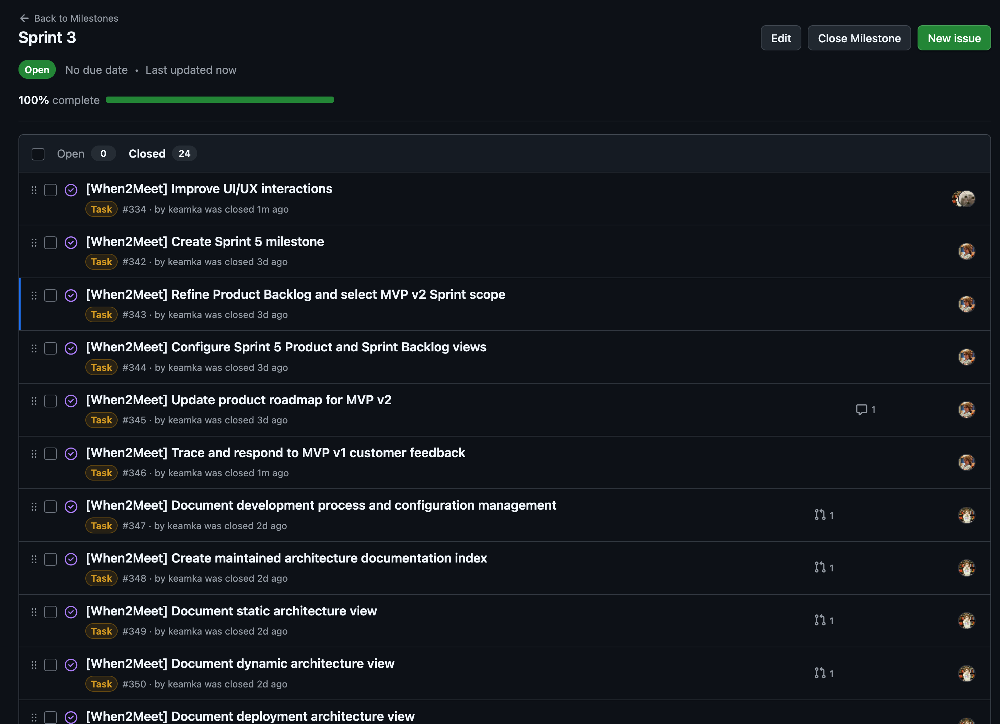
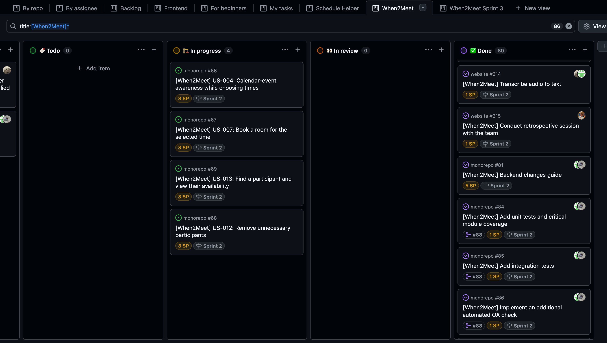
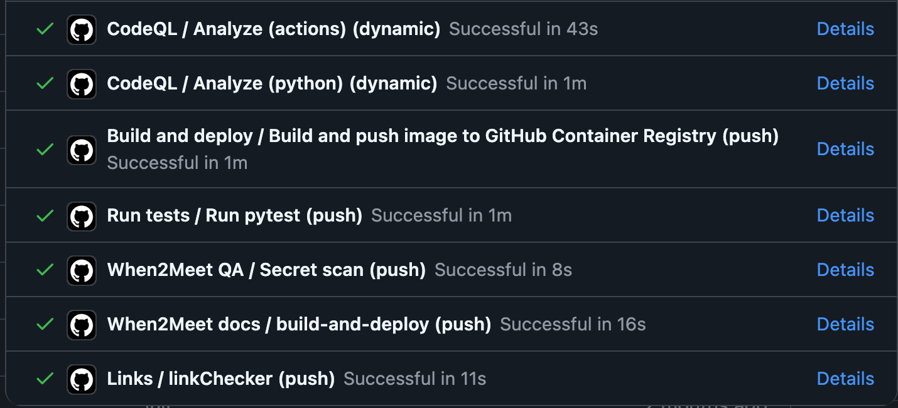

# Week 6 Report — When2Meet

InNoHassle service for planning meeting availability (SWP Assignment 6 / Sprint 4 / **Week 6 trial release**).

- **License:** [MIT License](https://github.com/one-zero-eight/monorepo/blob/main/LICENSE)
- **Repository:** [one-zero-eight/monorepo](https://github.com/one-zero-eight/monorepo) — `src/when2meet/`

## Sprint 4 summary

| Item | Value |
|---|---|
| **Sprint Goal** | Deliver a stable Week 6 trial / handover-candidate release with clearer final-time and room-booking flows, heatmap readability improvements, maintained customer-handover documentation, and transition-readiness evidence for the customer trial |
| **Dates** | 6 July 2026 – 12 July 2026 (Week 6) |
| **Sprint milestone** | [Sprint 4](https://github.com/one-zero-eight/monorepo/milestone/4) |
| **Total Story Points** | 37 |
| **Scope summary** | Selected meeting time, room booking lifecycle, heatmap legend, participant names on slots, customer handover docs, Sprint Review / UAT / documentation review, presentation deck rehearsal |

Velocity note: several 1-SP tasks finished faster than planned; the presentation deck (3 SP) was completed in two days.

### Workflow links

| Item | Link |
|---|---|
| Product Backlog board | [GitHub Project view 19](https://github.com/orgs/one-zero-eight/projects/4/views/19) |
| Sprint Backlog board / table | [GitHub Project view 20](https://github.com/orgs/one-zero-eight/projects/4/views/20) |
| Sprint milestone | [Sprint 4](https://github.com/one-zero-eight/monorepo/milestone/4) |
| Roadmap | [docs/roadmap.md](../../docs/roadmap.md) |

### Week 6 trial-release changes

- Separated final meeting-time selection from optional room booking ([#125](https://github.com/one-zero-eight/monorepo/issues/125), [#126](https://github.com/one-zero-eight/monorepo/issues/126), [#127](https://github.com/one-zero-eight/monorepo/issues/127)).
- Backend + frontend room booking: list available rooms, book, show booked room, change/cancel ([#128](https://github.com/one-zero-eight/monorepo/issues/128), [#129](https://github.com/one-zero-eight/monorepo/issues/129), [#130](https://github.com/one-zero-eight/monorepo/issues/130), [#139](https://github.com/one-zero-eight/monorepo/pull/139)).
- Heatmap legend for selected vs aggregate availability ([#124](https://github.com/one-zero-eight/monorepo/issues/124)).
- Participant / event names on overlapping timeslots ([#131](https://github.com/one-zero-eight/monorepo/issues/131)).
- Maintained customer handover documentation ([#132](https://github.com/one-zero-eight/monorepo/issues/132), [#133](https://github.com/one-zero-eight/monorepo/pull/133), [#148](https://github.com/one-zero-eight/monorepo/pull/148)).
- Sprint Review outcomes published ([#150](https://github.com/one-zero-eight/monorepo/issues/150), [#151](https://github.com/one-zero-eight/monorepo/pull/151)).

### Deployment and run instructions

| Item | Link |
|---|---|
| Hosted frontend (React SPA) | [https://pre.innohassle.ru/when2meet](https://pre.innohassle.ru/when2meet) |
| Hosted API / Swagger | [https://api.innohassle.ru/when2meet/v0/docs](https://api.innohassle.ru/when2meet/v0/docs) |
| Root README / When2Meet entry | [monorepo README — When2Meet](../../../../README.md#when2meet) |
| Customer handover | [docs/customer-handover.md](../../docs/customer-handover.md) |
| Contributing | [CONTRIBUTING.md](https://github.com/one-zero-eight/.github/blob/main/CONTRIBUTING.md) |
| Agent instructions | [AGENTS.md](../../../../AGENTS.md) |
| Hosted documentation site | [https://one-zero-eight.github.io/monorepo/](https://one-zero-eight.github.io/monorepo/) |

## Customer-facing documentation review

Customer reviewed `README.md` and [docs/customer-handover.md](../../docs/customer-handover.md) (access, deployment, troubleshooting, limitations).

| Finding | Detail |
|---|---|
| Clear | Product purpose, current access URLs, handover scope, configuration without secrets |
| Matches expectations | Customer confirmed both documents match her expectations for the reached handover level |
| Missing / unclear | No blocking gaps identified for Week 6 trial use |

## Transition-readiness summary

| Topic | Status |
|---|---|
| Trial product access | Deployed on Team 108 pre-production; customer confirmed transfer to Team 108 |
| Documentation | Accepted by customer for the current handover level |
| Independent use | Customer can use the hosted trial; mobile validation requested before final release |
| Customer-side ops | Deployment/secrets/admin remain with Team 108 / InNoHassle maintainers |
| Week 7 must still happen | Legend placement, clear selected-time, mobile validation, MVP v3 release and final transition confirmation |

## Customer feedback response

| Feedback point | Resulting PBI or issue | Status | Response |
|---|---|---|---|
| Separate final time from room booking | [#125](https://github.com/one-zero-eight/monorepo/issues/125), [#126](https://github.com/one-zero-eight/monorepo/issues/126), [#127](https://github.com/one-zero-eight/monorepo/issues/127) | Done | Demonstrated and accepted |
| Room booking lifecycle | [#128](https://github.com/one-zero-eight/monorepo/issues/128), [#129](https://github.com/one-zero-eight/monorepo/issues/129), [#130](https://github.com/one-zero-eight/monorepo/issues/130) | Done | UAT-003 / UAT-006 passed |
| Heatmap legend | [#124](https://github.com/one-zero-eight/monorepo/issues/124) | Done (placement follow-up) | Delivered; move to top in Sprint 5 |
| Participant names on slots | [#131](https://github.com/one-zero-eight/monorepo/issues/131) | Done | Demonstrated and accepted |
| README + customer handover completeness | [#132](https://github.com/one-zero-eight/monorepo/issues/132) | Done | Customer reviewed; matches expectations |
| Cannot clear selected final time | Sprint 5 via [#146](https://github.com/one-zero-eight/monorepo/issues/146) | Open | Bug found in demo; queued for Week 7 |
| Validate mobile before release | Sprint 5 / MVP v3 checklist | Open | Customer condition for final release |
| Post-course bug-fix support | Documented in handover | Accepted with follow-up | Informal support channel expected |

**Feedback not yet addressed in Sprint 4:** legend top placement, selected-time clear bug, mobile validation, and formal post-course support process — all carried into [Sprint 5](https://github.com/one-zero-eight/monorepo/milestone/5) / [#146](https://github.com/one-zero-eight/monorepo/issues/146).

## Maintained documentation (Sprint 4)

| Artifact | Link |
|---|---|
| Roadmap | [docs/roadmap.md](../../docs/roadmap.md) |
| Customer handover | [docs/customer-handover.md](../../docs/customer-handover.md) |
| Interface | [docs/interface.md](../../docs/interface.md) |
| UAT | [docs/user-acceptance-tests.md](../../docs/user-acceptance-tests.md) |
| Testing | [docs/testing.md](../../docs/testing.md) |
| Quality requirements | [docs/quality-requirements.md](../../docs/quality-requirements.md) |
| Quality requirement tests | [docs/quality-requirement-tests.md](../../docs/quality-requirement-tests.md) |
| Definition of Done | [docs/definition-of-done.md](../../docs/definition-of-done.md) |
| Development process | [docs/development-process.md](../../docs/development-process.md) |
| Architecture | [docs/architecture/README.md](../../docs/architecture/README.md) |
| Changelog | [CHANGELOG.md](../../CHANGELOG.md) |

## UAT / customer-trial summary (public, sanitized)

Full scenarios: [docs/user-acceptance-tests.md](../../docs/user-acceptance-tests.md).

| UAT | Result (2026-07-12) | Follow-up |
|---|---|---|
| UAT-001 Calendar overlay | Passed | Hide-calendar toggle remains optional polish |
| UAT-003 Room booking | Passed | Re-test after external service outages |
| UAT-004 Selected-slot legend | Passed (change request) | Move legend to top |
| UAT-006 Change/cancel room | Passed | Keep contract tests green |
| Overall | Customer accepted — service works as expected | Mobile validation in Week 7 |

Private Sprint Review / UAT / transition recording: Moodle submission only (not committed).

## Week 6 SemVer trial release

| Item | Link |
|---|---|
| Trial release section | [CHANGELOG.md — 0.3.0](../../CHANGELOG.md#030----week-6-trial-release-sprint-4--assignment-6) |
| Sprint milestone | [Sprint 4](https://github.com/one-zero-eight/monorepo/milestone/4) |
| Week 6 report | [reports/week6/README.md](README.md) |
| Customer handover | [docs/customer-handover.md](../../docs/customer-handover.md) |

## Sprint events and Week 6 artifacts

| Artifact | Link |
|---|---|
| Sprint Review summary | [sprint-review-summary.md](sprint-review-summary.md) |
| Sprint Review transcript | [sprint-review-transcript.md](sprint-review-transcript.md) |
| Sprint retrospective | [retrospective.md](retrospective.md) |
| Week reflection | [reflection.md](reflection.md) |
| LLM usage report | [llm-report.md](llm-report.md) |

Publication: sanitized English Sprint Review transcript is published in the repository ([sprint-review-transcript.md](sprint-review-transcript.md)). Private recording and exact instructor-only details stay in the Moodle PDF.

## Product status and expected Week 7 follow-up

**Current status:** Week 6 trial release is deployed, customer-reviewed, documentation-accepted, and UAT-accepted for core flows. Handover level remains **Ready for independent use** on Team 108 pre-production.

**Expected Sprint 5 / Week 7 work:** legend placement, selected-time clear bug, mobile validation, final transition confirmation, `MVP v3` release, Demo Day prep updates. Sprint 5 milestone: [Sprint 5](https://github.com/one-zero-eight/monorepo/milestone/5).

## Contribution traceability (Sprint 4)

| Member | Issues / PRs / reviews / testing / docs / transition / presentation |
|---|---|
| Nikita Lisitskiy | Sprint Planning; Sprint Review facilitation; customer documentation review and UAT confirmation |
| Vladislav Konovalov | Week 6 report / Moodle PDF; feedback traceability ([#149](https://github.com/one-zero-eight/monorepo/issues/149)); presentation deck (3 SP, 2 days); rehearsal coordination |
| Mikhail Istomin | Frontend trial-release UX (legend, selected time, room booking UI, participant names) |
| Dmitrii Chudin | Backend selected-time and room-booking APIs ([#136](https://github.com/one-zero-eight/monorepo/pull/136)–[#139](https://github.com/one-zero-eight/monorepo/pull/139)); README / CHANGELOG ([#147](https://github.com/one-zero-eight/monorepo/pull/147), [#148](https://github.com/one-zero-eight/monorepo/pull/148)) |
| Timur Khasanov | Customer handover ([#132](https://github.com/one-zero-eight/monorepo/issues/132) / [#133](https://github.com/one-zero-eight/monorepo/pull/133)); Sprint Review demo and transcript/summary ([#150](https://github.com/one-zero-eight/monorepo/issues/150) / [#151](https://github.com/one-zero-eight/monorepo/pull/151)) |

## Screenshots

| Screenshot | File |
|---|---|
| Sprint milestone / Sprint backlog | [sprint-milestone.png](images/sprint-milestone.png) |
| Product backlog | [product-backlog.png](images/product-backlog.png) |
| Latest `main` CI | [latest-ci-run.png](images/latest-ci-run.png) |
| Coverage report | [coverage-report.png](images/coverage-report.png) |
| Secret scan | [secret-scan-result.png](images/secret-scan-result.png) |
| Reviewed PR | [reviewed-pr.png](images/reviewed-pr.png) |
| Deployed product | [deployed-product.png](images/deployed-product.png) |
| Branch protection | [branch-protection.png](images/branch-protection.png) |

### Embedded screenshots

## Moodle PDF

Typst sources: [pdf/week6-report.typ](pdf/week6-report.typ) — compile with [pdf/README.md](pdf/README.md).

Private items in PDF only: university emails, private recording link, exact UAT/Sprint Review timecodes, rehearsed presentation video link, participation attribution. Slide deck PDF is submitted on Moodle only (not committed).
