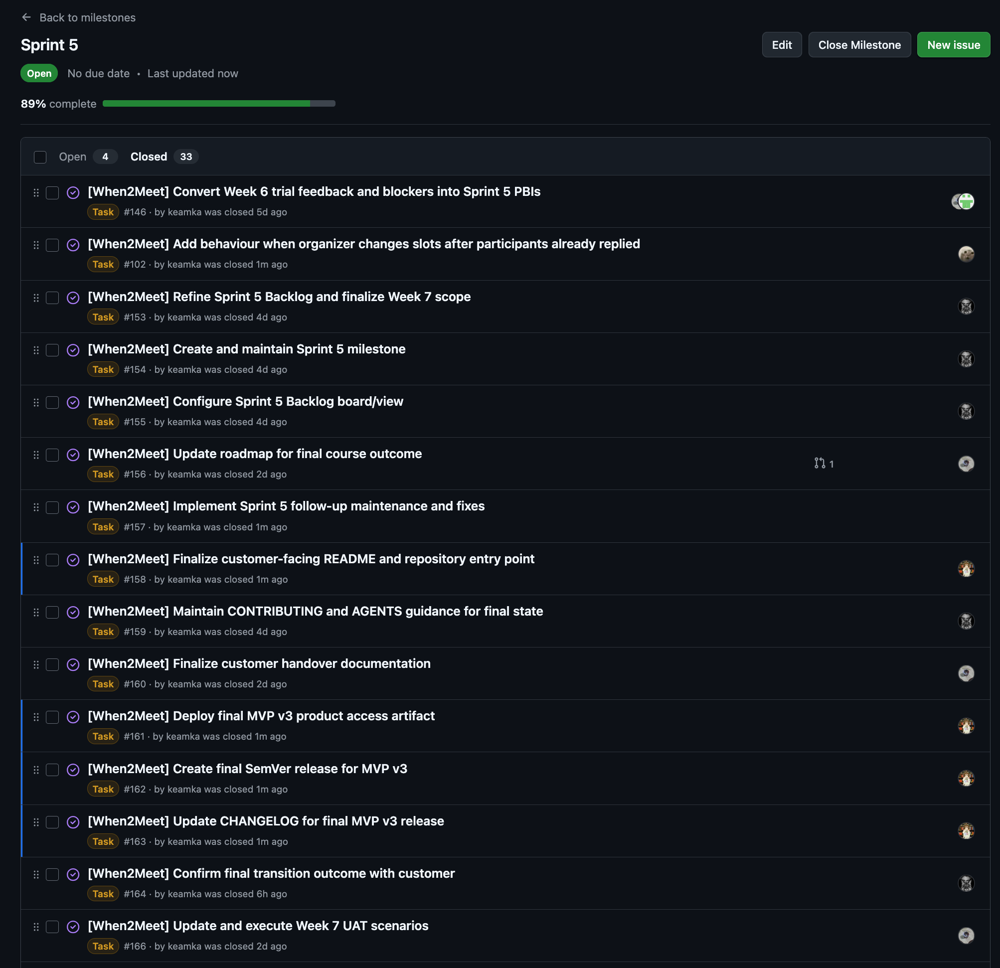
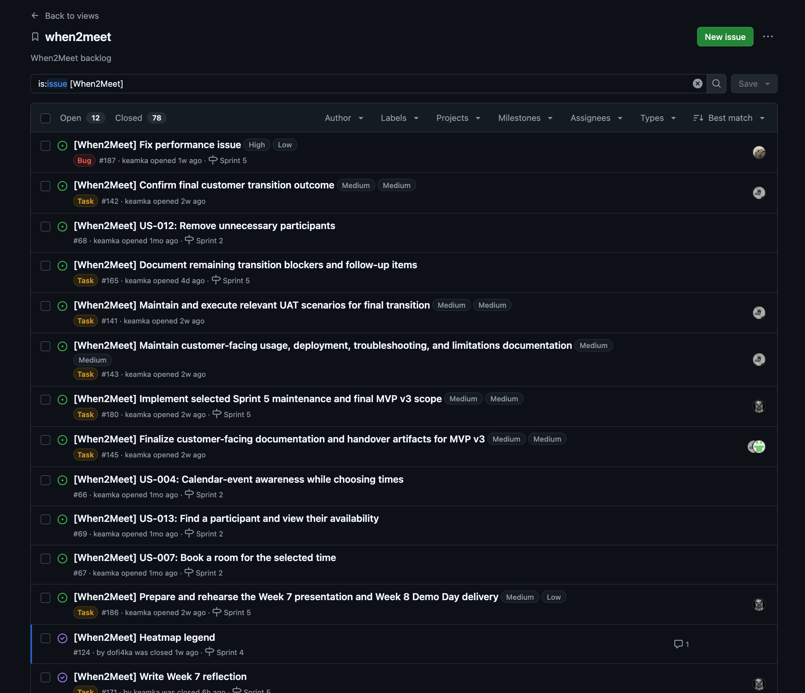
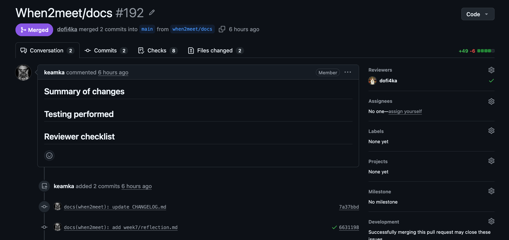
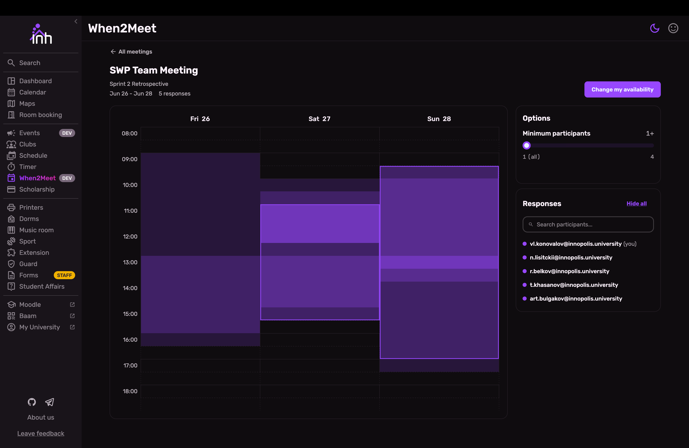

# Week 7 Report — When2Meet

InNoHassle service for planning meeting availability (SWP Assignment 6 / Sprint 5 / **MVP v3 final course delivery**).

- **License:** [MIT License](https://github.com/one-zero-eight/monorepo/blob/main/LICENSE)
- **Repository:** [one-zero-eight/monorepo](https://github.com/one-zero-eight/monorepo) — `src/when2meet/`
- **Week 6 evidence index:** [reports/week6/README.md](../week6/README.md)
- **Submission commit:** update after merge to protected `main` (permalinks in the Moodle PDF)

## Sprint 5 summary

| Item | Value |
|---|---|
| **Sprint Goal** | Use Week 6 trial feedback to complete final maintenance, confirm transition status, and deliver the final course version `MVP v3` |
| **Dates** | 13 July 2026 – 19 July 2026 (Week 7) |
| **Sprint milestone** | [Sprint 5](https://github.com/one-zero-eight/monorepo/milestone/5) |
| **Total Story Points** | _Confirm from Sprint 5 board (see ask below)_ |
| **Scope summary** | Week 6 follow-ups (selected-time clear, legend placement, mobile validation), timezone-safe selected time, final handover docs, UAT, MVP v3 delivery, Demo Day prep |

### Workflow links

| Item | Link |
|---|---|
| Product Backlog board | [GitHub Project view 19](https://github.com/orgs/one-zero-eight/projects/4/views/19) |
| Sprint 5 Backlog board / table | [GitHub Project view 20](https://github.com/orgs/one-zero-eight/projects/4/views/20) |
| Sprint 5 milestone | [Sprint 5](https://github.com/one-zero-eight/monorepo/milestone/5) |
| Week 6 report | [reports/week6/README.md](../week6/README.md) |
| Roadmap | [docs/roadmap.md](../../docs/roadmap.md) |

### Week 7 follow-up and MVP v3 changes

- Timezone-aware selected meeting times through available-room lookup and booking ([#152](https://github.com/one-zero-eight/monorepo/pull/152)).
- Organizers can clear or replace the selected final meeting time when no room is booked (Week 6 bug follow-up via [#146](https://github.com/one-zero-eight/monorepo/issues/146)).
- Heatmap legend moved above the availability grid; mobile scrolling and slot-selection improved for customer validation.
- Roadmap, customer handover, UAT, and quality/CI evidence updated for final course delivery ([#156](https://github.com/one-zero-eight/monorepo/issues/156), [#160](https://github.com/one-zero-eight/monorepo/issues/160), [#166](https://github.com/one-zero-eight/monorepo/issues/166), [#167](https://github.com/one-zero-eight/monorepo/issues/167)).
- Sprint Review outcomes published ([#169](https://github.com/one-zero-eight/monorepo/issues/169) / [#181](https://github.com/one-zero-eight/monorepo/issues/181)).

### Deployment and run instructions

| Item | Link |
|---|---|
| Hosted frontend (React SPA) | [https://pre.innohassle.ru/when2meet](https://pre.innohassle.ru/when2meet) |
| Hosted API / Swagger | [https://api.innohassle.ru/when2meet/v0/docs](https://api.innohassle.ru/when2meet/v0/docs) |
| Root README / When2Meet entry | [monorepo README — When2Meet](../../../../README.md#when2meet) |
| Customer handover | [docs/customer-handover.md](../../docs/customer-handover.md) |
| Contributing | [CONTRIBUTING.md](https://github.com/one-zero-eight/.github/blob/main/CONTRIBUTING.md) |
| Agent instructions | [AGENTS.md](../../../../AGENTS.md) |
| Hosted documentation site | [https://one-zero-eight.github.io/monorepo/](https://one-zero-eight.github.io/monorepo/) |

## Final transition outcome

| Field | Value |
|---|---|
| **Handover level** | `Ready for independent use` |
| **Customer-confirmation status** | `Accepted with follow-up items` |

Evidence: [docs/customer-handover.md](../../docs/customer-handover.md), [sprint-review-summary.md](sprint-review-summary.md), [sprint-review-transcript.md](sprint-review-transcript.md).

### What was transferred, delegated, or retained

Summarized from [customer-handover.md](../../docs/customer-handover.md):

- **Available / transferred for customer use:** hosted product and API on Team 108 / InNoHassle pre-production, public repository source under `src/when2meet`, hosted docs, Swagger, UAT/testing/quality/architecture guidance.
- **Delegated:** InNoHassle Accounts SSO, calendar context, room-booking product integration.
- **Retained by Team 108 / InNoHassle:** deployment host access, runtime secrets, monitoring, rollback, repository administration, CI/release operations.

### Remaining blockers, limitations, and follow-up items

| Item | Owner side | Notes |
|---|---|---|
| Mobile viewport: keep selection results on-screen without scrolling away | Team (post-course) | Customer accepted as minor; outside SWP scope |
| Heatmap legend prominence / purple-shade labels on desktop and mobile | Team (post-course) | Partially addressed in Sprint 5; further polish post-course |
| More discoverable slot selection than double-click-and-drag | Team (post-course) | Agreed outside SWP |
| Full customer-side ops (secrets, deploy, monitoring) | External / platform | Not in course handover scope |
| Post-course bugfix and user-feedback support | Team 108 | Customer expectation if members remain on Team 108 |

### Customer use / deployment evidence (public, sanitized)

- Customer confirmed hosted deployment on InNoHassle and ownership/handover to Team 108 during the Week 7 Sprint Review.
- Customer approved MVP v3 as ready for release and complete against stated functionality.
- Stronger levels `Independently used by customer` / `Deployed or operated on customer side` (customer-owned infra) were not the course target; operation remains on Team 108 hosted pre-production.

Private recording, exact timecodes, and written confirmation screenshots stay in the Moodle PDF only.

## Customer feedback response (Sprint 5)

| Feedback point | Resulting PBI or issue | Status | Response |
|---|---|---|---|
| Clear selected final time | [#146](https://github.com/one-zero-eight/monorepo/issues/146) | Done for course | Delivered in MVP v3 |
| Legend above heatmap | [#124](https://github.com/one-zero-eight/monorepo/issues/124) / [#146](https://github.com/one-zero-eight/monorepo/issues/146) | Done with optional polish | Moved above grid; further labeling polish post-course |
| Validate mobile before release | Sprint 5 / [#146](https://github.com/one-zero-eight/monorepo/issues/146) | Done for course | Mobile demo + customer validation; residual viewport UX post-course |
| Timezone-safe selected time for rooms | [#152](https://github.com/one-zero-eight/monorepo/pull/152) | Done | Explicit offset required and forwarded |
| Viewport-local mobile feedback | Post-course via [#146](https://github.com/one-zero-eight/monorepo/issues/146) / [#149](https://github.com/one-zero-eight/monorepo/issues/149) | Accepted follow-up | Outside SWP |
| Slot-selection discoverability | Post-course | Accepted follow-up | Outside SWP |
| Team 108 ongoing support | Handover docs | Accepted | Documented support expectation |

## Week 7 UAT / customer-trial summary (public, sanitized)

Full scenarios: [docs/user-acceptance-tests.md](../../docs/user-acceptance-tests.md).

| UAT | Result (Week 7) | Follow-up |
|---|---|---|
| UAT-001 Calendar overlay | Passed by regression | Optional hide-calendar polish |
| UAT-003 Room booking + timezone | Passed | Keep contract tests green |
| UAT-004 Selected-slot legend | Passed with optional polish | Legend labeling polish post-course |
| UAT-006 Change/cancel room | Passed | Keep lifecycle tests green |
| Overall | Customer accepted MVP v3 as release-ready | Minor UX outside SWP |

## MVP v3 SemVer section (no GitHub Release artifact)

Per team process, GitHub Releases are not used. Changelog section documents the final increment:

| Item | Link |
|---|---|
| MVP v3 changelog section | [CHANGELOG.md — 0.4.0](../../CHANGELOG.md#040----mvp-v3-sprint-5--assignment-6) |
| Sprint milestone | [Sprint 5](https://github.com/one-zero-eight/monorepo/milestone/5) |
| Week 7 report | [reports/week7/README.md](README.md) |
| Customer handover | [docs/customer-handover.md](../../docs/customer-handover.md) |
| Public sanitized demo video | [Yandex Disk demo](https://disk.yandex.ru/i/K8_tvcbO6OXcbQ) |

## Demo Day preparation

- Week 7 lab rehearsal preparation completed (slide deck updated to `When2Meet-presentation-v1-4.pdf`, submitted on Moodle only — not committed).
- Public sanitized MVP v3 demo video linked above for the under-2-minute in-class demo.
- Private standing rehearsal video remains in the Week 6 Moodle channel; Week 7 Moodle PDF carries Sprint Review / transition recording and confirmation evidence.

## Sprint events and Week 7 artifacts

| Artifact | Link |
|---|---|
| Sprint Review summary | [sprint-review-summary.md](sprint-review-summary.md) |
| Sprint Review transcript | [sprint-review-transcript.md](sprint-review-transcript.md) |
| Sprint retrospective | [retrospective.md](retrospective.md) |
| Week reflection | [reflection.md](reflection.md) |
| LLM usage report | [llm-report.md](llm-report.md) |

Publication: sanitized English Sprint Review transcript is published in the repository. Private recording and exact instructor-only details stay in the Moodle PDF.

## Final product status

**Status:** MVP v3 is deployed on Team 108 pre-production, customer-accepted as functionally complete and release-ready, with handover level **Ready for independent use** and confirmation **Accepted with follow-up items** (optional UX polish and ongoing Team 108 support). Assignment 4 / 5 quality gates remain active.

Latest protected-default-branch CI (at report assembly):

| Check | Result | Link |
|---|---|---|
| Run tests | Success | [GitHub Actions run 29689579980](https://github.com/one-zero-eight/monorepo/actions/runs/29689579980) |
| When2Meet QA secret scan | Success | [GitHub Actions run 29689579983](https://github.com/one-zero-eight/monorepo/actions/runs/29689579983) |
| Links | Success | [GitHub Actions run 29689579981](https://github.com/one-zero-eight/monorepo/actions/runs/29689579981) |

## Contribution traceability (Sprint 5)

| Member | Issues / PRs / reviews / testing / docs / transition / Demo Day |
|---|---|
| Nikita Lisitskiy | Sprint 5 Planning; Week 7 Sprint Review facilitation; final transition confirmation with customer |
| Vladislav Konovalov | Week 7 report / Moodle PDF; Demo Day / rehearsal slide deck (`When2Meet-presentation-v1-4`); feedback/report assembly |
| Mikhail Istomin | Frontend MVP v3 UX (mobile scrolling, slot selection, legend placement); Sprint Review demo |
| Dmitrii Chudin | Backend timezone-safe selected time ([#152](https://github.com/one-zero-eight/monorepo/pull/152)); changelog / API contract support |
| Timur Khasanov | Customer handover / UAT / docs maintenance; Sprint Review transcript and summary support |

## Screenshots

Screenshots reused from prior weeks where Sprint 5-specific captures were not regenerated (CI / protection / product access patterns are unchanged). Replace `sprint-milestone.png` / `product-backlog.png` with Sprint 5 board captures when available.

| Screenshot | File |
|---|---|
| Sprint milestone / Sprint backlog | [sprint-milestone.png](images/sprint-milestone.png) |
| Product backlog | [product-backlog.png](images/product-backlog.png) |
| Latest `main` CI | [latest-ci-run.png](images/latest-ci-run.png) |
| Coverage report | [coverage-report.png](images/coverage-report.png) |
| Secret scan | [secret-scan-result.png](images/secret-scan-result.png) |
| Reviewed PR | [reviewed-pr.png](images/reviewed-pr.png) |
| Deployed product | [deployed-product.png](images/deployed-product.png) |
| Branch protection | [branch-protection.png](images/branch-protection.png) |

### Embedded screenshots

## Moodle PDF

Typst sources: [pdf/week7-report.typ](pdf/week7-report.typ) — compile with [pdf/README.md](pdf/README.md).

Private items in PDF only: university emails, private Sprint Review / transition recording link, exact timecodes, private access notes, transition-confirmation proof note, participation attribution. Slide deck PDF is submitted on Moodle only (not committed). `assignment.md` is local only and must not be committed.
